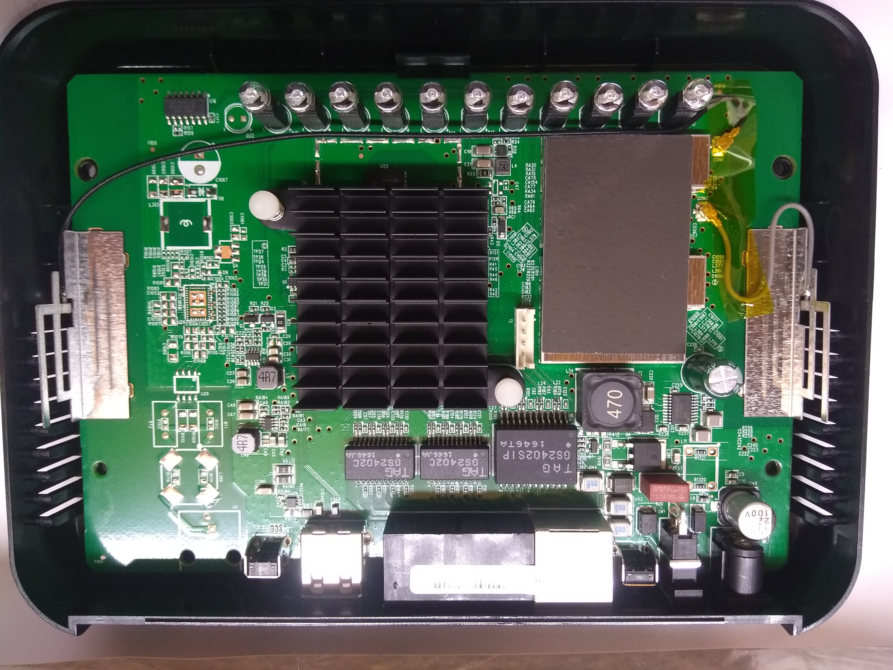
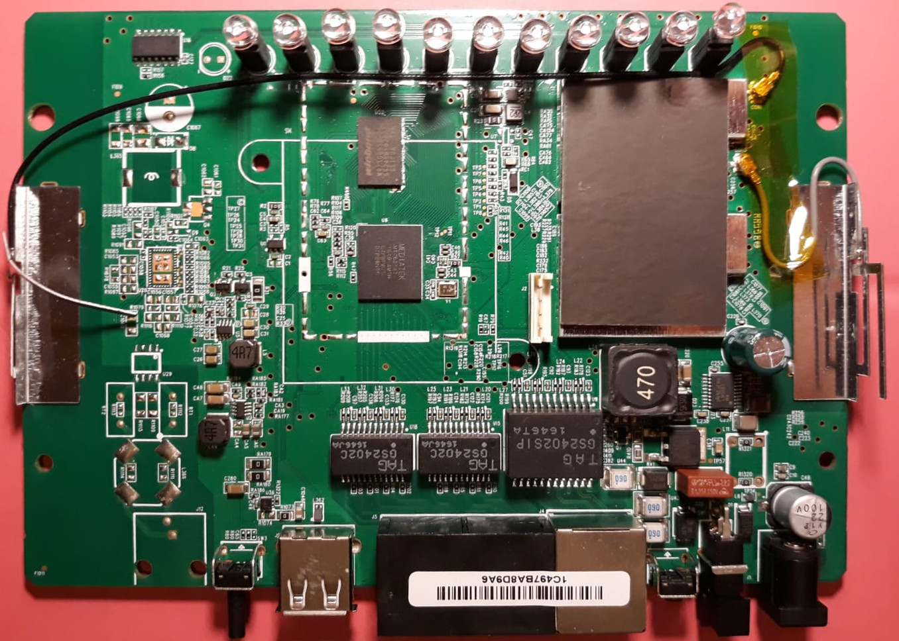
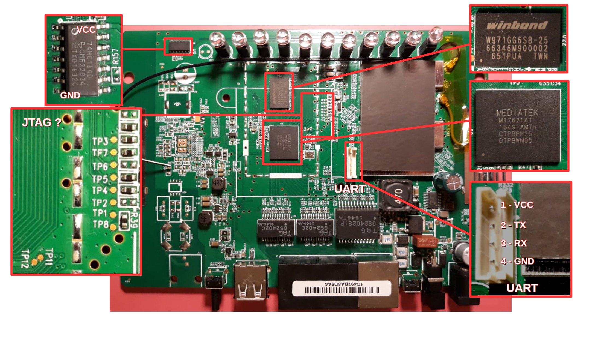
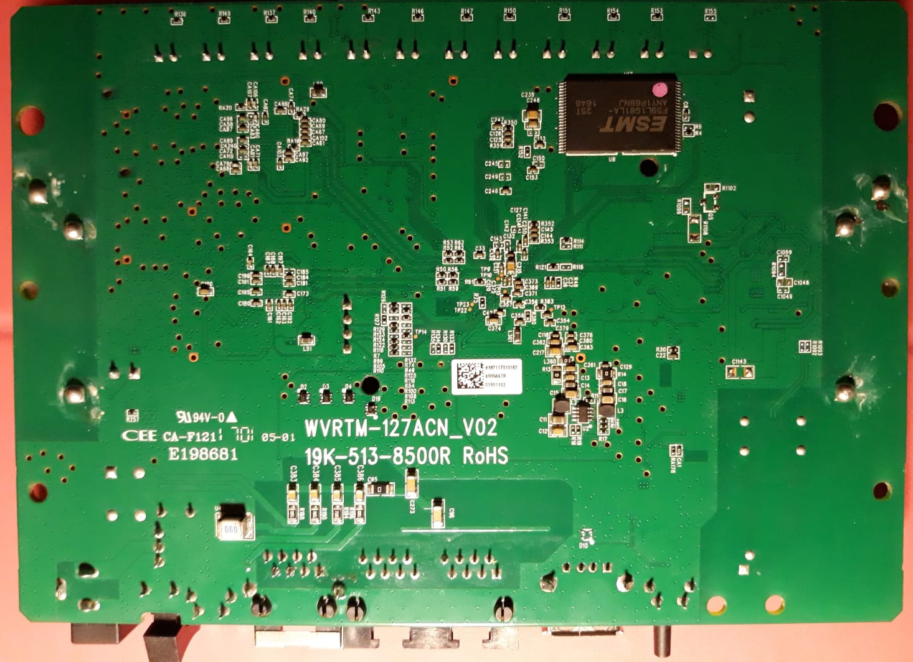
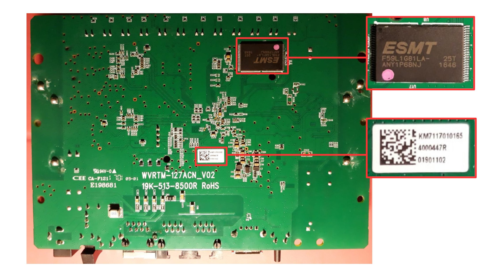
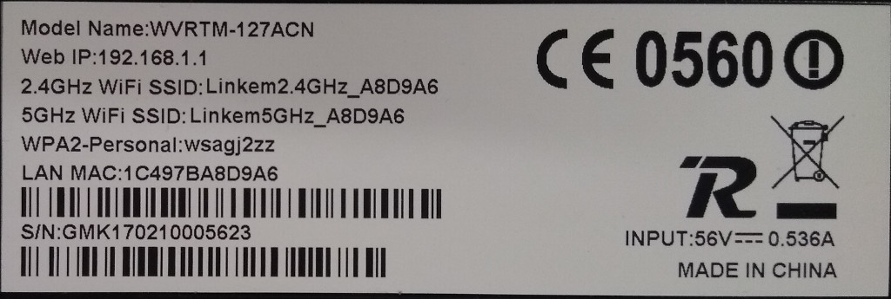

# Description

**hacking-gemtek** is a reverse engineering project of a Gemtek home router (model WVRTM-127ACN) distributed in Italy by Linkem (a Wireless ISP) with the scope to modify the firmware to add useful software, as an sshd daemon, and to understand how the default WiFi router password is generated. It includes an emulation environment based on Qemu and Docker, a firmware modification kit and a default WiFi password generator. The project follows the reverse engineering process described by the author in a [talk at Hack In Paris 2019](http://va.ler.io/2019/0616/hack_paris_2019_cyber_security_conference.html) Cybersecurity Conference.

# Table of Contents

- [Description](#description)
- [Table of Contents](#table-of-contents)
- [Quick Start](#quick-start)
- [Building the emulation environment](#building-the-emulation-environment)
	- [Emulation environment requirements](#emulation-environment-requirements)
	- [Choosing the tool to build the Root File System](#choosing-the-tool-to-build-the-root-file-system)
	- [Issues to overcome](#issues-to-overcome)
	- [The Docker image](#the-docker-image)
	- [Buildroot configuration](#buildroot-configuration)
	- [Running Buildroot](#running-buildroot)
- [Reverse Engineering Router's Binaries](#reverse-engineering-routers-binaries)
	- [File system and console output analysis](#file-system-and-console-output-analysis)
	- [Reverse Engineering `sig_verify`](#reverse-engineering-sigverify)
		- [Listing `sig_verify` library calls](#listing-sigverify-library-calls)
		- [Starting the emulated Machine](#starting-the-emulated-machine)
		- [Starting `gdbserver` on the emulated Machine](#starting-gdbserver-on-the-emulated-machine)
		- [Starting `gdb` in the host machine](#starting-gdb-in-the-host-machine)
		- [Generate a Public Key file in *pem* format with the MPIs in `sig_verify`](#generate-a-public-key-file-in-pem-format-with-the-mpis-in-sigverify)
		- [`mysig_verify`: a script that does the same job as `sig_verify`](#mysigverify-a-script-that-does-the-same-job-as-sigverify)
		- [Conclusion on reverse engineering `sig_verify`](#conclusion-on-reverse-engineering-sigverify)

# Quick Start --- NOTA paragrafo da modificare

On a Linux box, the only OS supported:

  * install Docker, [this guide](https://www.digitalocean.com/community/tutorials/how-to-install-and-use-docker-on-ubuntu-18-04), or similar guides, can be useful
  * add your username to the *docker* group with a command similar to the following (can be different in some Linux distributions):
     ```
     $ sudo adduser *yourusername* docker
     ```
  * install [Qemu](https://www.qemu.org/), using something similar to the following commands:
    ```
    $ sudo apt-get install qemu qemu-block-extra qemu-kvm qemu-slof qemu-system \
      qemu-system-arm qemu-system-common qemu-system-mips qemu-system-misc \
      qemu-system-ppc qemu-system-s390x qemu-system-sparc qemu-system-x86 \
      qemu-user qemu-user-binfmt qemu-utils
    ```
  * install [Binwalk](https://github.com/ReFirmLabs/binwalk), using something similar to the following commands:
    ```
    $ sudo apt-get install binwalk
    ```
  * install [Jefferson](https://github.com/sviehb/jefferson), following instructions on the GitHub repository
  * download this project with command similar to the followings:
    ```
    valerio@ubuntu-hp:~$ mkdir br      # configuration script will create folders here
    valerio@ubuntu-hp:~$ cd br
    valerio@ubuntu-hp:~/br$ git clone https://github.com/digiampietro/buildroot-armv7.git buildroot-armv7
    ```
  * type the following commands, the `br-armv7-config.sh` script will download Buildroot, Linux kernel, router firmware and will configure the environment
    ```
    valerio@ubuntu-hp:~/br$ cd buildroot-armv7   
    valerio@ubuntu-hp:~/br/buildroot-armv7$ ./br-armv7-config.sh
    ```
  * download the docker image from the Docker repository
    ```
    valerio@ubuntu-hp:~/br/buildroot-armv7$ docker pull digiampietro/buildroot-armv7
    ```
  * run the docker image, it is based on the old Debian Wheezy to run the old buildroot-2014-02; the current username and home directory are mapped inside the docker host. Inside the docker host the command prompt has changed, the hostname now is *BRHOST*:
    ```
    valerio@ubuntu-hp:~/br/buildroot-armv7$ cd docker/
    valerio@ubuntu-hp:~/br/buildroot-armv7/docker$ ./dockrun.sh
    valerio@BRHOST:~$ cd ~/br/buildroot-armv7
    ```
  * run the *Buildroot* make using the *brmake* shell script that sets the *BR2_EXTERNAL* environment variable to use a customized buildroot external tree:
    ```
    valerio@BRHOST:~/br/buildroot-armv7$ ./brmake dvaemu-emu_arm_vexpress_defconfig
    valerio@BRHOST:~/br/buildroot-armv7$ ./brmake # takes a loooong time
    ```
  * at the end of the buildroot process a root file system image has been built, ready to be used by *Qemu*, running outside the docker machine:
    ```
    valerio@BRHOST:~/br/buildroot-armv7$ exit
    root@BRHOST:/src/misc# exit
    valerio@ubuntu-hp:~/br/buildroot-armv7/docker$ cd ../qemu-run/
    valerio@ubuntu-hp:~/br/buildroot-armv7/qemu-run$ ./qr
    ...
    reeing init memory: 160K
    smsc911x 4e000000.ethernet: eth0: SMSC911x/921x identified at 0xc08c0000, IRQ: 47
    Welcome to Buildroot
    buildroot login: root
    root@buildroot:~# uname -a
    Linux buildroot 3.4.11-rt19 #1 SMP PREEMPT Fri Sep 28 18:46:38 UTC 2018 armv7l GNU/Linux
    root@buildroot:~#
    ```
  * an ARM virtual machine is now available to run debug and reverse engineer the most interesting router executables. The router root file system has been included in the ARM image in the folder `/dva-root`, the firmware files and file system images are included in the folder `/dva-firm`:
    ```
    root@buildroot:~# ls /dva-root/
    bin         dev.tar.gz  mnt         sbin        usr
    data        etc         proc        sys         var
    dev         lib         root        tmp         www
    root@buildroot:~# ls /dva-firm/
    DVA-5592_A1_WI_20180405.sig  root-fs.bin
    boot-fs.bin                  set-nandsim.sh
    ```
  * to exit from the Qemu virtual machine you can type `# halt` and then press `Ctrl-A` followed by the key `X`

# The Reverse Engineering Process

The Reverse Engineering Process in this project, is based on

* **Information gathering** to identify hardware and software components of the devices an get the firmware and the root file system;
* **Build an emulation environment** using QEMU, Buildroot and Docker to have a debugging friendly environment where to run interesting device binaries;
* **Analyze how the device works** doing file system analysis and reverse engineering of interesting binaries in the emulated environment;
* **Build a firmware modification kit** to simplify the process to create an alternative firmware to load into the devices.

This process is described in a [talk at Hack In Paris 2019](http://va.ler.io/2019/0616/hack_paris_2019_cyber_security_conference.html) Cybersecurity Conference:

* [Slides of the talk in pdf format](http://www.digiampietro.com/myfiles/dva/IOT-RE-HackInParis-sv.pdf)
* [Slides of the talk with the transcript of the presentation](http://www.digiampietro.com/myfiles/dva/IOT-RE-HackInParis-annotated.pdf)
* [Video of the presentation on youtube](https://www.youtube.com/watch?v=MiigXigpRt0)

# Information gathering

The information gathering process is usually based on three steps:

* **Searching information on Internet**, using the device name and manufacturer as search string;
* Opening the case and **inspecting the device**, identifying main device components, UART and JTAG interface;
* Finding a way to **get the firmware** and the root file system from the vendor web site or from the EEPROM

## Searching information on Internet

Using the device manufacturer name *Gemtek*, the device model *WVRTM-127ACN* and the ISP provider name *Linkem* it is possible to find a lot of information on Internet:

* device [information at wikidevi](https://wikidevi.com/wiki/Gemtek_WVRTM-127ACN) that gives very useful info:
	* **CPU**: [MediaTek MT7621AT](https://wikidevi.com/wiki/MediaTek_MT7621), it has a 32bit [MIPS](https://wikidevi.com/wiki/MIPS32) 100K4c architecture, running at 880Mhz with a dual core/quad thread processor;
	* **RAM**: 128Mb, device: ESMT M14D1G1664A-2.5B;
	* **EEPROM**: 128Mb, Nand Flash device: ESMT F59L1G81LA-25T;
* [FCC documentation](https://fcc.io/MXF/-WVRTM127ACN) that includes external and internal pictures of the device and a "Quick start Manual".

Anyway it was not possible to find the UART and JTAG location and pinout.

## Inspecting the device

It is quite easy to open the case and extract the main board:

### Main board top



### Main board top without the heatsink



### Main board top annotated



### Main board bottom



### Main board bottom annotated



### Identifying main device components

Reading the text printed on top of every integrated circuit is not easy, but with a [small trick](https://electronics.stackexchange.com/questions/5186/how-to-read-the-text-printed-on-top-of-every-ic), using alcohol and a white chalk, it is not difficult either. In the photo, of the [**main board top**](#main-board-top-annotated) and of the [**main board bottom**](#main-board-bottom-annotated), the main integrated circuits are clearly readable and it is possible to identify:
* the **System On a Chip** is a [*Mediatek MT7621AT*](http://www.t-firefly.com/download/FireWRT/hardware/MT7621.pdf), this confirm what was found on *wikidevi*;
* the **RAM** is a 128Mb [*Winbond W971GG6SB*](https://media.digikey.com/pdf/Data%20Sheets/Winbond%20PDFs/W971GG6SB.pdf) 8M x 8 BANKS x 16 BIT DDR2 SDRAM, this is different from what was found on *wikidevi*;
* the [**74HC164**](https://assets.nexperia.com/documents/data-sheet/74HC_HCT164.pdf), it is discrete logic IC, quite unusual to find it on a modern main board, but can be useful because his GND and VCC pins can be used as a reference;
* the **NAND Flash Memory**, on the mainboard bottom, is a [*F59L1G81LA*](https://www.esmt.com.tw/upload/pdf/ESMT/datasheets/F59L1G81LA%282Y%29.pdf) a 1 Gbit (128M x 8) 3.3V NAND Flash Memory, this confirm what was found on *wikidevi*.

### Locating the UART interface

On the [main board top](#main-board-top-annotated) there is a white 4 pin connector, the pin 1 is at the top, the pin 4 is at the bottom, it is the perfect candidate for the UART interface; with a multi-meter we can take the following measurements:

**main board switched off, resistance measurements**
* **pin 1** the resistance between this pin and VCC is 0 Ohm (VCC is pin 14 of 74HC164D)
* **pin 2** the resistance between this pin and VCC is infinite and between this pin and GND is 4.7 KOhm (GND is pin 7 of 74HC164D)
* **pin 3** the resistance between this pin and VCC is infinite and between this pin and GND is infinite
* **pin 4** the resistance between this pin and GND is 0 Ohm

**main board switched on, voltage measurements**
* **pin 1** is at 3.35V (VCC)
* **pin 2** is at 3.31V, but it oscillates randomly between 1.66V to 3.31V when booting
* **pin 3** is at 3.25V, it remains constant when booting
* **pin 4** is at 0V (GND)

The multi-meter gives a voltage measurements that is the average of the actual voltage over a period of few hundreds milliseconds; when booting a lot of text is written on the UART interface (it is the *serial console*), this means that the TX pin will oscillate between 0 and 1 (between 0V and 3.3V), for this reason measuring the voltage with a multi-meter on the TX pin will give an oscillating measurements. If nothing is written to the UART, the TX pin will remain at logic 1 (3.3V).

Based on the above measurements we can assume that that this 4 pin connector is the UART interface and that the pinout is:

* **pin 1** is VCC
* **pin 2** is TX
* **pin 3** is RX (by exclusion)
* **pin 4** is GND

To confirm that it is the UART interface we connect this interface to a PC with a TTL Serial Adapter, we select a 3.3V TTL serial adapter (or select the 3.3V mode in a double mode serial adapter), we connect:
* UART pin 4 - GND to the GND pin of the TTL serial adapter
* UART pin 2 - TX to the RX pin of the TTL serial adapter
* UART pin 3 - RX to the TX pin of the TTL serial adapter
* we leave the UART pin 1 - VCC unconnected

We can now fire up a serial emulator on our PC, like [PuTTY](https://www.putty.org/), switch on the device and log and watch what is [printed on the serial console during boot](./images/putty-linkem.log).

### (Not) Locating the JTAG interface

On the main board there aren't other pin headers arranged in a single or a double row, there are some test points (see [main board top picture](#main-board-top-annotated)) labeled TP1, TP2, TP3, TP4, TP5, TP6, TP7, TP8, TP11, TP12; they are not regularly arranged and, probably, they are used to test the board after manufacture using a [bed of nails tester](https://en.wikipedia.org/wiki/In-circuit_test#Bed_of_nails_tester). TP usually stands for "Test Point", so, probably, these points, or some of them, can belong to the JTAG interface but they are quite difficult to use because, not having a bed of nails tester, it is needed to solder a wire to each point to discover if they belong to the JTAG interface. For this reason we don't investigate further and move forward without locating the JTAG interface.

## Gathering information from the serial console when booting

Looking at what is [printed on the serial console when booting](./images/putty-linkem.log) we can get a lot of useful information:

* the boot loader is U-Boot version 1.1.3
```
U-Boot 1.1.3 (Oct 23 2015 - 16:03:05)
```
* parameters of the NAND device, can be useful to know in the emulation environment and to re-write the firmware
```
mtd->writesize=2048 mtd->oobsize=64,  mtd->erasesize=131072  devinfo.iowidth=8
```
* the WiFi chip, that was hidden in the main board top, is a Ralink chip; it is confirmed the the SoC is a Mediatek MT7621A with a dual core CPU running at 880 Mhz and that the RAM has 128 Mbytes
```
Ralink UBoot Version: 4.3.2.0
 --------------------------------------------
ASIC MT7621A DualCore (MAC to MT7530 Mode)
...
##### The CPU freq = 880 MHZ ####
estimate memory size =128 Mbytes
```
* U-Boot presents a menu and allows the boot to be interrupted and to enter a U-Boot command line interface, this can be very interesting
```
Please choose the operation:
   1: Load system code to SDRAM via TFTP.
   2: Load system code then write to Flash via TFTP.
   3: Boot system code via Flash (default).
   4: Entr boot command line interface.
   9: Load Boot Loader code then write to Flash via TFTP.
```
* Details of the booting kernel, this can be useful when trying to modify the firmware and boot an alternate firmware. Later we will discover that the Image 0 is the Linux kernel and that Image 1 is the squashfs read only root file system
```
3: System Boot system code via Flash.
## Booting image at 81000000 ...
   Image Name:   =01.01.02.090
   Image Type:   MIPS Linux Multi-File Image (lzma compressed)
   Data Size:    19062732 Bytes = 18.2 MB
   Load Address: 80001000
   Entry Point:  8000f540
   Contents:
   Image 0:  1966004 Bytes =  1.9 MB
   Image 1: 17096704 Bytes = 16.3 MB
   Verifying Checksum ... OK
   Uncompressing Multi-File Image ... OK
## Transferring control to Linux (at address 8000f540) ...
## Giving linux memsize in MB, 128
Starting kernel ...
```
* Kernel version 2.6.36 and kernel command line; the firmware has been built with Buildroot version 2015-02. Buildroot is the same build system we will use in our emulation environment. Confirmation that the CPU instruction set is MIPS 1004Kc and that we have a squashfs root file system
```
[    0.000000] Linux version 2.6.36 (snapshot@Michelle) (gcc version 4.5.4 (Buildroot 2015.02-svn12502) ) #1 SMP PREEMPT Fri Jan 22 15:01:55 CST 2016
...
[    0.000000] Kernel command line: console=ttyS0,115200n8 console=ttyS0,115200n8
...
[    0.204000] CPU revision is: 0001992f (MIPS 1004Kc)
...
[    2.416000] squashfs: version 4.0 (2009/01/31) Phillip Lougher
...
[    3.448000] RAMDISK: squashfs filesystem found at block 0
[    3.452000] RAMDISK: Loading 16696KiB [1 disk] into ram disk... done.
[    4.052000] VFS: Mounted root (squashfs filesystem) readonly on device 1:0.
```
* How the NAND device is partitioned
```
[    2.760000] Creating 9 MTD partitions on "MT7621-NAND":
[    2.764000] 0x000000000000-0x000000100000 : "Bootloader"
[    2.772000] 0x000000100000-0x000000200000 : "Bootloader2"
[    2.776000] 0x000000200000-0x000000300000 : "Config"
[    2.784000] 0x000000300000-0x000000580000 : "Env1"
[    2.788000] 0x000000580000-0x000000800000 : "Env2"
[    2.792000] 0x000000800000-0x000002800000 : "Kernel"
[    2.800000] 0x000002800000-0x000004800000 : "Kernel2"
[    2.804000] 0x000004800000-0x000006400000 : "Storage1"
[    2.808000] 0x000006400000-0x000007f80000 : "Storage2"
```
* It can be useful to rewrite the partition table in number of blocks of 1024 bytes, to be used, later, in dd command
```
 Nr    Start  Length   Name
 --  -------  -------  ------------
  1        0   1,024   Bootloader
  2    1,024   1,024   Bootloader2
  3    2,048   1,024   Config
  4    3,072   2,560   Env1
  5    5,632   2,560   Env2
  6    8,192  32,768   Kernel
  7   40,960  32,768   Kernel2
  8   73,728  28,672   Storage1
  9  102,400  28,160   Storage2
```

* It is a system based on Busybox version 1.23.1. Busybox is very popular in embedded devices because a small binary implements a lot of functionalities (init, shell, many linux commands)
```
init started: BusyBox v1.23.1 (2016-01-22 15:02:56 CST)
```
* The partition 8 (mtd8) is a UBI file system using lzo compression
```
[    5.052000] UBI: attached mtd8 to ubi8
[    5.056000] UBI: MTD device name:            "Storage2"
...
[    5.352000] UBIFS: mounted UBI device 8, volume 0, name "mtd8"
[    5.356000] UBIFS: file system size:   23744512 bytes (23188 KiB, 22 MiB, 187 LEBs)
[    5.364000] UBIFS: journal size:       1142784 bytes (1116 KiB, 1 MiB, 9 LEBs)
[    5.372000] UBIFS: media format:       w4/r0 (latest is w4/r0)
[    5.376000] UBIFS: default compressor: lzo
[    5.380000] UBIFS: reserved for root:  1121511 bytes (1095 KiB)
```
* Some keys are generated during boot
```
## Error: "clientkey" not defined
## Error: "clientcert" not defined
## Error: "private_key_header" not defined
[         AES_Key_Gen]     202   MAC=[1C:49:7B:A8:D9:A6]
[         AES_Key_Gen]     203   Customer=[Linkem]
[         AES_Key_Gen]     208   key=[1C:49:7B:A8:D9:A6Linkem] len[23]
```
* Firmware version
```
[   21.212000] FW Version:0.0.00 Build:1
```
* The router has some process implementing the [CWMP (CPE WAN Management Protocol)](https://en.wikipedia.org/wiki/TR-069) to be remotely controlled and try to contact, multiple times, the provider server acs.linkem.com; because I didn't connect the router to Internet, it cannot resolve the hostname and cannot contact his master
```
[TR069_A4] ACS Connect Failed: Could not resolve host acs.linkem.com[TR069_A4]  [startInformRetryTimer] @ [553] retry = 1 waitTime = 5 sec
[TR069_A4] ACS Connect Failed: Could not resolve host acs.linkem.com[TR069_A4]  [startInformRetryTimer] @ [553] retry = 2 waitTime = 16 sec
[TR069_A4] ACS Connect Failed: Could not resolve host acs.linkem.com[TR069_A4]  [startInformRetryTimer] @ [553] retry = 3 waitTime =
```
* At the end of the booting process a login prompt is shown, but trying to login with a username ("admin" in this case) the system responds with a "Challenge code", this means that it is not the Linux standard /bin/login process
```
buildroot login: admin
Challenge code:
mZkq7ohJax+YwmOgTHSTRwdKotmQkVqX4tOZQt0ypomSRQz6RkKsj/TAOD32iXjy
focWSRrrIUFEeqQaShH3+xZHFe8znuCYBfZrdXdyzTShql0OpT+i62XRwLbwGaBw
ptcOpWX6dANtb612WXLEFaLfL4yEBDbChVSKVrre9RsrKFL4YblAPKGDQEdlt05i
lC2ZDX0TNQOgWKkarAAVgHO5LnOdgyPT4SakKzZfH2JmYEbRhbCBRTVhYkqcZ3J8
NqT0lI5QKcWwYURE0foJc7+YCm7NU+MPzyt/3tEl5l8JjjZLxgg8p2xBX9/42372
pcE3rtIoUWGT6/2l5hN6eA
Authentication code: admin
Fail!
```

## Gathering information from the boot loader CLI

As seen in the previous paragraph it is possible to press "4", within a second, when the U-Boot menu appears on the serial console to enter the U-Boot command line interface. Pressing help it is possible to discover the U-Boot commands available:
```
MT7621 # help
?       - alias for 'help'
bootm   - boot application image from memory
go      - start application at address 'addr'
help    - print online help
md      - memory display
mdio    - Ralink PHY register R/W command !!
mm      - memory modify (auto-incrementing)
nand    - nand command
nm      - memory modify (constant address)
printenv- print environment variables
reset   - Perform RESET of the CPU
saveenv - save environment variables to persistent storage
setenv  - set environment variables
tftpboot- boot image via network using TFTP protocol
version - print monitor version
```
```
MT7621 # help nand
nand nand usage:
  nand id
  nand read <flash_offset> <len> [dst_addr]
  nand write <flash_offset> <src_addr> <len>
  nand erase_write <flash_offset> <src_addr> <len>
  nand page <number>
  nand erase <addr> <len>
  nand erase_ignore_bad_block <flash_offset> <len>
  nand list_bad_block
  nand oob <number>
  nand dump
  nand init
```
```
MT7621 # help md
md [.b, .w, .l] address [# of objects]
    - memory display
```
The U-Boot environment variables are:
```
U-Boot 1.1.3 (Oct 23 2015 - 16:03:05)
MT7621 # printenv
bootdelay=1
baudrate=115200
ethaddr="00:AA:BB:CC:DD:10"
filesize=c5900c
fileaddr=81000000
ipaddr=10.10.10.123
serverip=10.10.10.3
Mmid=WVRTM-127ACN
version_uboot=U-Boot 1.1.3 (Oct 23 2015 - 16:03:05)
lanaddr=1C:49:7B:A8:D9:A6
mid=WVRTM-127ACN
cid=Linkem
pid=LTE CPE
hid=V02
dmid=WVRTM-127ACN
serial=GMK170210005623
LTE_SupportBand_Mask=0000060000000000
dsp_port_number=0
wmxaddr=1C:49:7B:A8:D9:A6
wifiaddr=1C:49:7B:A8:D9:A7
11acaddr=1C:49:7B:A8:D9:A8
mtddevnum=6
root_chain_cert=QlpoOTFBWSZTWYDk05wABNX/lOiQAEDAC//iP///+H////AEAAAAgAhgBx75ASgA AABpoHIGlRo9IDagA9TEBiADQADIAGIMqQAGgaAA0B6gehAGgyAAA4yZNGIYmmAg YE0wRgmJppoAMIcZMmjEMTTAQMCaYIwTE000AGEElRDTJqeQ1T21DSbUwT0p6nkn tUbKY9Ih7UZIPTQJShMjJhNMjTTQGgNDQAGpphNUBHojij33kKslxWHEOJuuISrE fyYweUAis4NELcbY2hkQroKCEIIsiI+kZmv+dBiMEx/JuFz/MjaZjhGaD1fLvSwc z/K5xGcEglxD+0FUNhcLhsFlvSRdiOFtGUpi9V0h57/GGYEDx+Ro7PcaULPFlRX4 cB18S8pK/M0NnDgDpiJ92camBGIaARYp9MerOCK6NQ+ckwvhtLZopyBmL5Of0wPl 1clA59lQSKJqNDbcSjxFEA7VqrSdAjUc1sWAxmj2nKvGAeIn4k2JolOdjW7KMuL+ ciGQymu0v8p3h9RYYUwIw+uzwWS8Z+5Oqj02kysG71U1oy6bGY2sWQudShO+UuFp 4qmUs8086Dy5+ZJMvvQsq2/NdxGi6/AtcmBaWS0SmTE9jqHap5csK6B1aNg2jGvx krSGiwEhu1zUkePRrHWRQtjDFZKAkS/+kuwpfbN5lT4XO5FuD8m+tSfoGOraG4z1 fsolHkiTwdmhlUppEnpOkc8ge2ETMxAXjX4Ba4ijGjqaUJuBxduqgwzKy1+04ayo UB7Kp2GXOALOjgvoSqKlQzFgFjmKBIKAsbk4bIeNMdLbJyyX/jBuItRrKQ6WRVsO CKnWW5gHymMDBGC5fJVz+E8ncovEwyZCIeKdYplVzC0uajcUFt0aLOq4eyEVz5Uo JfZOn/L4ODpuMQfgTy3GFC6NWAbruQX0ZNJ+1dgWl5IykZGi6x7CmlUWOR18cKhU CE6fQnhN8Yl4cNnm2a8TpXRQJID2u8VAXKApqHGkNIUh9OCX7BmBchNI+qMFIVxF 3aKloWCoYB0XOVEesLTJgxgqF0bMiWhnr2aKhhehJUxWLx5GTCZS+Tpo5UwvkJVJ +FVOZAl8GD0CgSq+vRJClsfBQe3OF/bNQ6LPEmsiMZtzHxMd0wEFUer4MLBmIbG1 8Z1lqoXwdRVHaRMahkHyYMiiYRo4DpQRJsNmcsDfvEVO59cAeLJIaC95IiUukQXL pCYtR5Op5XGFJj0QExtdKpOedovZYR8b8iplMvhG85Y4J8SXfaTowtcLmfoRZRqE JlahlV1cAs4D18a3k5MdUwEIsSjSVBYV4qG4aMwwbShgZJC4kIoaS2bwpjDB8NQ4 MuQxaUkMIWbyPPiphR3kfhYpJqkyC4fCUDGkTffk3Mk0+AZT0j9dI0grW+xY/I2u 40eDCLd1I0qMGgkrxczQzaFbbh0PvdxspMjekgSSUdBgoKRZxqjNUVNkTGcRkVGx QlGxp08OHGi4di8VkowlV+c0OhAKlf0w84SkZYCubxhwdhOJcPeyUsJ0pnT7KnQ2 i8JdB44t+D65rc7oVncM/2sNGc3u7DIJysmMtGcZIhcFBUMR1tH5yHB/uV8/iAh6 kR24lobErmDbMbBcPGLLnDKnseXH7hhM5GYcJ1ITomovdMAyEfoVIhYiGBLDVsuG zgwkBro7m+2jJTyzHk8lNqtmHPHZIAsouX7cxEX7PAHEvbSDePGCBYYLA34mTUzg SnUNCwTF4N5gDcTCpwIzVDw9H3YrdMSbLiY0n/Midzki0Dw8MFQ+hYkO5UPXUeLr 7Ls+3SJAEMZ37o4flc7lVO+a4s74fQnTdgNpwCPlAMJuytihvphdOhGMJWGoY205 9059hkuhXbJI/1/Kf+aN8JzL5pMROnZOrJ1CbENlAZBmDZbRwpkwRz2lzFeHMLjt UDhciRuzq8VoXUwktuIJBnKwlseTlaNoVUr+Q9DFIduXLyh5veISsNJtHBQoeA4o oqaRcqlYMxlFx323KmdMNQWgOyazM+czSSZgxEhWLxSW1TokN55Ec9dUWy9c+i3J 9MfPLrIjMcOlXecVW+dz311paOkBsBlgwivmJV1QIExPaR8p8WV8LWPPQbVjDVtS uz2uCKXU3Fz4NE4z5Sr0zDO6oZB0asGg7kXvsSVZvu6GqoKpqOkt8gHG5DKfDinb GvUL424OlI/a0k9DlqBHkwjZinkxb0WN9l9HyBINmYQn7iEKQBly0O6zyTl9ThxH vgf6Zk88ch19JqMIN+tKh0ZKT/pKyHHFaNisU4ZWHE/dD/UFgK13KcxTASJ0yZXa B8xlNPsh3FgUPsTIE21QQkMsANKCrWglJWb3uClhL44HQ46Q40scZXKUodPII0Cj iMy8OAnmSp+IvtrobKgFxgKyFxdOkXhsYQzGMKUq1Y9YjSSj5ObxUVRUiUPRoxmY sguVxe7OUj74F4LbQqNh599N9Fp7rofKxTExJ9JsYRwdNfNLJwC517lcKafJDF8n jclZvYwiLR+JdJTm7ZlO6bi75EP/i7kinChIQHJpzgA=
stdin=serial
stdout=serial
stderr=serial

Environment size: 3108/131067 bytes
```
### The most interesting U-Boot variables
* **fileaddr**=81000000 it is the memory address where to load the boot image
* **ipaddr**=10.10.10.123 it is the IP address of the device assigned to it by U-Boot and used only for the tftp boot image loading
* **serverip**=10.10.10.3 it is the IP address of the TFTP server, this is the address to assign to the PC with the tftpd daemon for tftp boot image loading
* **mtddevnum**=6 probably it is the partition to load the boot image from (first partition is "0", partition 6 is "kernel" partition)
* **root_chain_cert** it looks like a base64 encoded file (chars in the set 'a' .. 'z','A' .. 'Z', '0' .. '9','+','/' and padding char '=' at the end); we can copy the string on a file "cert.txt" and decode:
```
$ # copy the root_chain_cert string to a file
$ cat > cert.txt
QlpoOTFBWSZTWYDk05wABNX/lOiQAEDAC//iP///+H////AEAAAAgAhgBx75ASgA
...
jclZvYwiLR+JdJTm7ZlO6bi75EP/i7kinChIQHJpzgA=
^D
$ # replace spaces with carriage returns and decode with base64
$ cat cert.txt | sed 's/ /\n/g' | base64 -d > cert.bin
$ file cert.bin
cert.bin: bzip2 compressed data, block size = 900k
$ # it is a bzip2 file, uncompress it to cert2.bin
$ bzcat cert.bin > cert2.bin
$ file cert2.bin
cert2.bin: POSIX tar archive (GNU)
$ # it is a tar archive
$ tar -xvf cert2.bin
cert/
cert/CA/
cert/CRL/
cert/server.pem
cert/servercert.pem
```
the file *servercert.pem* is a public certificate, *server.pem* includes both the private key and the public certificate (the same included in *servercert.pem*). Anyway the purpose of these key and certificate are unknown, at the moment.

### The most interesting U-Boot commands
* **nand page <num>** prints the hex value of a NAND page: 2048 bytes plus 64 bytes of OOB (Out Of Band data, used for a sort of "error correction"). This command will be used to dump the entire NAND Flash EEPROM
* **tftpboot** that allows to boot from a tftp server, this will be used during the development of a modified kernel+squashfs
* **nand read** to move kernel+squashfs from EEPROM to RAM
* **bootm** to boot from memory

#### U-Boot manually booting from the CLI
We know the memory address where to load the boot image (U-Boot variable fileaddr=81000000) and the Flash EEPROM partitions, so we know the U-Boot command do boot from different sources:
* boot from "kernel" partition (at EEPROM address 0x800000, length 0x2000000)
```
MT7621 # nand read 800000 2000000 81000000
read len: 33554432
0x00800000 copy to 0x81000000
MT7621 # bootm
## Booting image at 81000000 ...
   Image Name:   =01.01.02.090
   Image Type:   MIPS Linux Multi-File Image (lzma compressed)
   Data Size:    19062732 Bytes = 18.2 MB
   Load Address: 80001000
   Entry Point:  8000f540
   Contents:
   Image 0:  1966004 Bytes =  1.9 MB
   Image 1: 17096704 Bytes = 16.3 MB
   Verifying Checksum ... OK
   Uncompressing Multi-File Image ... OK
## Transferring control to Linux (at address 8000f540) ...
## Giving linux memsize in MB, 128
#
Starting kernel ...
```
* boot from "kernel2" partition (at EEPROM address 0x2800000, length 0x2000000)
```
MT7621 # nand read 2800000 2000000 81000000
read len: 33554432
0x02800000 copy to 0x81000000
MT7621 # bootm
## Booting image at 81000000 ...
   Image Name:   =01.01.02.090
   Image Type:   MIPS Linux Multi-File Image (lzma compressed)
   Data Size:    21528524 Bytes = 20.5 MB
   Load Address: 80001000
   Entry Point:  8000f540
   Contents:
   Image 0:  1966004 Bytes =  1.9 MB
   Image 1: 19562496 Bytes = 18.7 MB
   Verifying Checksum ... OK
   Uncompressing Multi-File Image ... OK
## Transferring control to Linux (at address 8000f540) ...
## Giving linux memsize in MB, 128
#
Starting kernel ...
```
* boot from tftp file server, the server must have ip=10.10.10.3
```
MT7621 # tftpboot 81000000 kernel

 netboot_common, argc= 3

 NetTxPacket = 0x87FE4480

 KSEG1ADDR(NetTxPacket) = 0xA7FE4480

 NetLoop,call eth_halt !

 NetLoop,call eth_init !
Trying Eth0 (10/100-M)

 Waitting for RX_DMA_BUSY status Start... done
#

 ETH_STATE_ACTIVE!!
TFTP from server 10.10.10.3; our IP address is 10.10.10.123
Filename 'kernel'.

 TIMEOUT_COUNT=10,Load address: 0x81000000
Loading: Got ARP REQUEST, return our IP
Got ARP REQUEST, return our IP
Got ARP REQUEST, return our IP
Got ARP REPLY, set server/gtwy eth addr (40:b0:34:09:1b:b4)
Got it
#################################################################
         #################################################################
...
         ######################################################
         32 MB reveived
         #
done
Bytes transferred = 33554432 (2000000 hex)
NetBootFileXferSize= 02000000
MT7621 # bootm
## Booting image at 81000000 ...
   Image Name:   =01.01.02.090
   Image Type:   MIPS Linux Multi-File Image (lzma compressed)
   Data Size:    21528524 Bytes = 20.5 MB
   Load Address: 80001000
   Entry Point:  8000f540
   Contents:
   Image 0:  1966004 Bytes =  1.9 MB
   Image 1: 19562496 Bytes = 18.7 MB
   Verifying Checksum ... OK
   Uncompressing Multi-File Image ... OK
## Transferring control to Linux (at address 8000f540) ...
## Giving linux memsize in MB, 128
.
Starting kernel ...
```

## Getting the firmware file

Visiting the supplier's website, both Linkem](https://web.linkem.com/) (the ISP provider) and [Gemtek](https://www.gemteks.com/en) (the manufacturer), it is impossible to find downloadable firmware upgrades, probably the upgrade happens only through the [CWMP](https://en.wikipedia.org/wiki/TR-069), remote management protocol, when the ISP provider decides that the router have to be upgraded.

This means that to get the firmware we have to download it from the NAND Flash EEPROM. Because we have access to the U-Boot command line and we have available the command "nand page *n*" we can dump all the EEPROM pages on standard output in ASCII format and then we can use a small program to convert back the ASCII hex dump to a binary EEPROM image file. For example:
```
MT7621 # nand page 0
page 0x0:
27 05 19 56 42 ee ee b3 56 29 e9 b9 00 02 25 fc a0 20 00 00 a0 20 00 00 c6 70 7e b0 05 05 01 00
4e 41 4e 44 20 46 6c 61 73 68 20 49 00 00 00 00 00 00 00 40 00 00 60 00 00 00 00 00 a2 0e b4 a1
...
00 00 5b af 21 d8 e0 03 21 f8 c0 03 08 00 60 03 00 00 00 00 00 00 00 00 00 00 00 00 00 00 00 00
00 00 00 00 00 00 00 00 08 00 c1 28 2e 00 20 14 21 10 80 00 26 50 a4 00 03 00 4a 31 33 00 40 15
#
oob:
ff ff ff ff ff ff ff ff ff ff ff ff ff ff ff ff ff ff ff ff ff ff ff ff ff ff ff ff ff ff ff ff
db 15 b2 47 1b fc f3 ff 7e dd 57 a5 d2 3d fb ff 5e 31 c4 f8 26 0d f7 ff ac d8 61 5a 0a 85 fd ff
```
it prints the entire content of the page 0 of the EEPROM (2 Kbytes), including the 64 bytes of the OOB (Out Of Band) area. To dump the entire EPROM content we have to print each one of the 65536 pages (from page 0 to page 65535), to do so we can use a small [expect](https://en.wikipedia.org/wiki/Expect) script "[*serial-flash-dump.expect*](./serial-flash-dump.expect)", available here; with no other program opening the serial interface, this script:
* opens the serial interface, passed as argument
* wait for the U-Boot menu prompt
* send the char "4" to select the U-Boot CLI
* send the "nand page 0" command, wait for the prompt, send the "nand page 1" command and so on
* each page is 2 Kbtyes, but the ASCII dump, including spaces, carriage returns and oob data, uses about 6450 bytes, this means that the dump of the entire ROM will be an ASCII file of about 400 Mb, to write this file on serial console running at 115200 bps it will require about 11 hours or more!

The entire EEPROM can be dumped to the ASCII file *eeprom.txt* with the following command:

```
$ # dump the entire EEPROM in ASCII, the following program will run for about 11 hours
$ # power down the device, start the following program, then power up the device
$ ./serial-flash-dump.expect /dev/ttyUSB0  | tee eeprom.txt
# ---> modem device: /dev/ttyUSB0
#---> connecting to /dev/ttyUSB0
spawn [open ...]
#---> waiting for U-Boot command prompt
...
Please choose the operation:
   1: Load system code to SDRAM via TFTP.
   2: Load system code then write to Flash via TFTP.
   3: Boot system code via Flash (default).
   4: Entr boot command line interface.
   9: Load Boot Loader code then write to Flash via TFTP.
#---> got command prompt

You choosed 4

 0


4: System Enter Boot Command Line Interface.

U-Boot 1.1.3 (Oct 23 2015 - 16:03:05)
MT7621 # nand page 0
page 0x0:
27 05 19 56 42 ee ee b3 56 29 e9 b9 00 02 25 fc a0 20 00 00 a0 20 00 00 c6 70 7e b0 05 05 01 00
4e 41 4e 44 20 46 6c 61 73 68 20 49 00 00 00 00 00 00 00 40 00 00 60 00 00 00 00 00 a2 0e b4 a1
...
```

After about 11 hours the *./serial-flash-dump.expect* script will terminate and the full EEPROM has been hex dumped to the file *eeprom.txt*, now with another script available here, [*hexdump2bin.pl*](hexdump2bin.pl), this hex dump can be converted back to binary format:

```
$ cat eeprom.txt | ./hexdump2bin.pl  > eeprom.bin
SUCCESS 65536 pages dumped, 134217728 bytes
```

### Splitting the EEPROM image partitions

Now the *eeprom.bin* file contains the full image of the device EEPROM, because we know (see above), how the EEPROM is partitioned we can extract a file image for each partition with the following commands, included in the script [**split-eeprom.sh**](./split-eeprom.sh),  so we can run this script instead of the following commands:

```
dd if=eeprom.bin of=01-bootloader.bin  bs=1024 skip=0      count=1024
dd if=eeprom.bin of=02-bootloader2.bin bs=1024 skip=1024   count=1024
dd if=eeprom.bin of=03-config.bin      bs=1024 skip=2048   count=1024
dd if=eeprom.bin of=04-env1.bin        bs=1024 skip=3072   count=2560
dd if=eeprom.bin of=05-env2.bin        bs=1024 skip=5632   count=2560
dd if=eeprom.bin of=06-kernel.bin      bs=1024 skip=8192   count=32768
dd if=eeprom.bin of=07-kernel2.bin     bs=1024 skip=40960  count=32768
dd if=eeprom.bin of=08-storage1.bin    bs=1024 skip=73728  count=28672
dd if=eeprom.bin of=09-storage2.bin    bs=1024 skip=102400 count=28160
```

Using *binwalk* on each image and *hexdump -C*, when needed, we can understand that:
* **01-bootloader.bin** is the U-Boot bootloader for OS Linux and CPU MIPS
* **02-bootloader2.bin** is unused, it has all bytes at default value (0xff)
* **03-config.bin** unrecognized by binwalk, probably contains some router configuration
* **04-env1.bin** contains U-Boot environment variables
* **05-env2.bin** contains U-Boot environment variables, only one byte is different from the previous file, probably it is the active environment partition flag
* **06-kernel.bin** contains an U-Boot header, a Linux kernel and a Squashfs file system. It is the boot image, and it is the starting point to modify the squashfs root file system
* **07-kernel2.bin** is exactly, bit by bit, the same content as the one above
* **08-storage1.bin** is an UBIFS file system, this is a writable, NAND Flash optimized, file system
* **09-storage2.bin** in another UBIFS file system

The router, probably, has duplicated partitions for bootloader, U-Boot environment, boot image, and storage to have a robust firmware upgrade system, the upgrade will go on the partition not active and then, if everything goes ok, the upgraded partition will become the active one.

The most interesting partition is the boot image partition (*06-kernel.bin*) because it includes the kernel and the root file system, to modify the firmware we are interested in modifying the root file system. It has a U-Boot header so we can understand exactly his content.

### Analyzing and splitting the boot image partition

The [U-Boot header format](http://www.isysop.com/unpacking-and-repacking-u-boot-uimage-files/) is the following:
```
#define IH_MAGIC    0x27051956    /* Image Magic Number     */
#define IH_NMLEN    32            /* Image Name Length      */

typedef struct image_header {
    uint32_t    ih_magic;             /* Image Header Magic Number */
    uint32_t    ih_hcrc;              /* Image Header CRC Checksum */
    uint32_t    ih_time;              /* Image Creation Timestamp  */
    uint32_t    ih_size;              /* Image Data Size           */
    uint32_t    ih_load;              /* Data     Load  Address    */
    uint32_t    ih_ep;                /* Entry Point Address       */
    uint32_t    ih_dcrc;              /* Image Data CRC Checksum   */
    uint8_t     ih_os;                /* Operating System          */
    uint8_t     ih_arch;              /* CPU architecture          */
    uint8_t     ih_type;              /* Image Type                */
    uint8_t     ih_comp;              /* Compression Type          */
    uint8_t     ih_name[IH_NMLEN];    /* Image Name            */
} image_header_t;

“Multi-File Images” start with a list of image sizes, each
image size (in bytes) specified by an “uint32_t” in network
byte order. This list is terminated by an “(uint32_t)0″.
Immediately after the terminating 0 follow the images, one by
one, all aligned on “uint32_t” boundaries (size rounded up to
a multiple of 4 bytes).
```

**In our case**, analyzing the actual U-Boot header, using *hexdump -C* command, we can understand that the *06-kernel.bin* can be divided in 4 parts:
* U-Boot header (64 bytes)
* Images lengths (24 bytes, 8 bytes for first image, 8 bytes for second image and 8 bytes, all "0", as terminator)
* Kernel image, lzma compressed
* Squashfs image

The *06-kernel.bin* can be splitted in these 4 components using the following commands, included in the [*mod-kit-run.sh*](./mod-kit/mod-kit-run.sh) in the *mod-kit* directory:
```
# get length of the two images
IMG1LEN=`(echo -n "ibase=16;obase=A;"; hexdump -s 64 -n 4 -ve '/1 "%02X"' 06-kernel.bin ;echo) | bc`
IMG2LEN=`(echo -n "ibase=16;obase=A;"; hexdump -s 72 -n 4 -ve '/1 "%02X"' 06-kernel.bin ;echo) | bc`

# extract the U-Boot header, first 64 bytes
dd if=06-kernel.bin bs=1  skip=0                          count=64       of=u01-hdr.dat

# extract the image lengths data segment, 24 bytes
dd if=06-kernel.bin bs=1  skip=64                         count=24       of=u02-len.dat

# extract the compressed kernel
dd if=06-kernel.bin bs=1  skip=88                         count=$IMG1LEN of=u03-kern.dat

# extract the squashfs file system image
dd if=06-kernel.bin bs=1  skip=`echo "88 + $IMG1LEN"|bc`  count=$IMG2LEN of=u04-sqfs.dat
```

### Extracting the squashfs root file system

To extract the squashfs root file system from the squashfs image we can use the following command:
```
fakeroot -s fakeroot.dat unsquashfs -d squashfs-root u04-sqfs.dat
```
The [fakeroot](http://manpages.ubuntu.com/manpages/bionic/man1/fakeroot-pseudo.1.html) command is to run the *unsquashfs* command as normal user and to prevent errors when extracting files owned by root and when extracting device special files. The *-s* option is useful to run again the fakeroot command resuming the same environment (regarding special device files and files ownership).

### Preliminary file system analysis

#### Buildroot configuration in the root file system

We know that the firmware has been built using Buildroot (see above, serial console output analysis during boot) so we are interested to see if some buildroot related stuff is available on the root file system:
```
# at the root of the extracted squashfs file system
$ find . -print|grep -i buildroot
./etc/buildroot_config
```
we have the *buildroot_config* file, it is really interesting to understand how the firmware was built and it is very useful in building the emulation environment using Buildroot. Some interesting Buildroot configurations:
* Target architecture
```
BR2_mipsel=y
BR2_ARCH="mipsel"
BR2_ENDIAN="LITTLE"
BR2_GCC_TARGET_ARCH="mips32r2"
BR2_GCC_TARGET_ABI="32"
BR2_ARCH_HAS_ATOMICS=y
BR2_BINFMT_SUPPORTS_SHARED=y
BR2_BINFMT_ELF=y
BR2_mips_32r2=y
BR2_MIPS_OABI32=y
```
* The Buildroot generated toolchain has been used
* The following components have been selected:
	* uClibc version 0.9.33.2
	* Kernel version 2.6.36.x
	* Binutils version 2.25
	* Gcc version 4.5.4
	* Use shadow passwords with sha-512 encryption
 	* Use Busybox as init processes and default shell
	* Use U-Boot, target architecture *MT7621A_DDR2*
	* Install host U-Boot tools
	* Install some Gemtek packages (custom packages)
	* Install a package named *fwupgrade* (interesting to upgrade the router with our own modified firmware)
	* Install libcrypt and openssl packages
	* Install some Linkem customer related stuff

#### Login process

We know that the login process is unusual (see [above](#gathering-information-from-the-boot-loader-cli), serial console output analysis during boot) because it asks for a username (as the standard */bin/login*), but then present a "Challenge code" instead of asking for a password. Looking at the Busybox Init configuration file, */etc/inittab*, we can see that the usual */sbin/getty* process manages the login on the serial console:
```
# Put a getty on the serial port
ttyS0::respawn:/sbin/getty -L  ttyS0 115200 vt100 # GENERIC_SERIAL
```
*/sbin/getty* usually executes */bin/login* but, in this case, */bin/login* is a soft link to */bin/shell_auth*, *shell_auth* probably is a custom developed replacement of the standard */bin/login*. In the emulation environment we will try to reverse engineer this script to understand if we can successfully do a login on the console using the unmodified firmware.

#### Startup scripts

The startup scripts are the Busybox standard startup scripts, in the */etc/inittab* configuration file there is the following line:
```
::sysinit:/etc/init.d/rcS
```
this means the the script /etc/init.d/rcS is executed during boot and it runs every script in /etc/init.d directory starting with 'S', these scripts are:

* **S10mountstorage** mounts the UBI file system over /mnt/jffs2
* **S11mountexternalusb** in our case it doesn't mount the USB key, it does nothing
* **S13portmap** starts the portmap daemon, it is usually needed to mount NFS file systems   
* **S15create_account.sh**  during first boot it copies /etc/passwd.default, /etc/group.default, /etc/shadow.default to /mnt/jffs2/etc/passwd, /mnt/jffs2/etc/group, /mnt/jffs2/etc/shadow. /etc/passwd is a link to /mnt/jffs2/etc/passwd and also the other files in /etc are links to corresponding files in /mnt/jffs2/etc/
* **S20urandom** it saves the random seed between reboots in the permanent UBIFS storage /mnt/jffs2/random-seed  
* **S40network** starts network interfaces
* **S49ntp** starts the NTP (Network Time Protocol) daemon  
* **S59snmpd** starts the SNMP (Simple Network Management Protocol) daemon   
* **S90crond** starts the cron daemon   
* **S99gemtek.sh** the above scripts are, more or less, pretty Linux standard stuff, this script, instead, initialize and starts the most router specific configuration and services; it configure specific router hardware, insert Gemtek specific modules into the kernel, modify some kernel parameters, and execute some interesting programs:
	* *cert_gen* probably some certificate generator program, but it gives error during boot
	* if the boot happens in "factory mode" (with the U-Boot variable *factory* set to value 2), the router starts a telnet daemon with the shell */bin/sh* listening (so without authentication) and broadcasts a UDP packet to the local LAN with the content "Gemtek Hello" from his factory IP address 192.168.15.1; on reboot the U-Boot variable *factory* is removed so the router restarts in normal mode. This fact is really interesting because **to get a root shell prompt is really easy**:
		* connect the TTL USB serial cable to the PC and start a terminal emulator with serial parameters 115200N8 (115200 bps, No parity, No Flow Control, 1 stop bit, 8 bit)
		* connect the PC to the router with an ethernet cable attached to one of the router's LAN interfaces
		* assign to the PC ethernet interface the IP address 192.168.15.100
		* power up the router and look at the terminal emulator
		* when appears the prompt "Please choose the operation" press the key "4" to enter the U-Boot CLI (key must be pressed within 1 second)
		* at the U-Boot CLI set the variable *factory* at value 2 with the command "*setenv factory 2*"
		* at the U-Boot CLI permanently save the U-Uboot environment with the command "*saveenv*"
		* power down the router, then power up again and wait until the boot is completed
		* from the PC connect to the router using telnet and you will have a root shell prompt. It is not possible to modify the read only squashfs root file system, but it is possible to explore the system and to modify the content of the ubifs file system mounted under */mnt/jffs2*
	* two other important custom daemon are started: *proc_mon* and *msg_center*. Using the *strings* command to have an idea of what this two executables do it seems that *proc_mon* monitors some processes and restart them if needed; *msg_center* seems to be the core of the router doing a lot of stuff and executing a lot of external commands to do practically anything. It is really really interesting to analyze the embedded strings in *msg_center*  

#### /etc/passwd and /etc/shadow files

*/etc/passwd* and */etc/shadow* are soft links to corresponding files in */mnt/jffs2/etc/*, the permanent read/write ubifs file system. The files on */mnt/jffs2/etc/* are copied, on first boot, from */etc/passwd.default* and */etc/shadow.default*.

The main users in these files are:
* root with /bin/sh shell, password is "5/4jp6", discovered searching on Internet the password hash in the shadow file  
* Lnk_Administrator with no shell (/bin/false)
* operator, disabled by default ('!' in password field) with no shell
* guest with no shell, it is the initial user that interacts with the web interface and the password is written on the user's manual  

# Building the emulation environment
The purpose of the emulation environment is to run, as much as possible, router executables in a Qemu virtual machine. This means not only that the machine must have a 32 bit, MIPS 1004Kc processor, but that kernel and libraries should be same version, or compatible version, as the one used in the router.

## Emulation environment requirements
The emulated environment should have:
  * a 32 bit MIPS 1004Kc processor
  * an emulated 128Mb Nand flash memory, emulated with the *nandsim* kernel flash emulator
  * a Linux Kernel version 2.6.36
  * a root file system using uClibc, version 0.9.33.2, as standard C library
  * other libraries with compatible versions with the router's binaries

## Choosing the tool to build the Root File System
The root file system can be built with a cross compilation toolchain able to generate binaries for the MIPS architecture on an Intel based Linux PC; but building the kernel, the libraries and the needed packages can be very challenging and time consuming because of the various version dependency that each package can have with other packages and standard libraries (the so called *dependency hell*). For this reason it is better to select a build tool able to manage this *dependency hell*, the most popular building tools for embedded devices are:
  * [The Yocto Project](https://www.yoctoproject.org/) is very powerful, not only builds a root file system, but is able to create a custom Linux distribution for the embedded device. It's main drawback is that it has a steep learning curve
  * [Buildroot](https://buildroot.org/) has a more limited scope: it builds the root file system and the kernel, it is quite easy and fast to learn and has a very good user manual, not too big, neither too small
  * [Openwrt/LEDE Build System](https://openwrt.org/docs/guide-user/additional-software/beginners-build-guide) is tailored mainly to build a replacement router firmware, his documentation is much more scattered in the web site and so requires more time to learn.

Buildroot has been the tool chosen for this reverse engineering project. It has been easy to learn ed effective in building the required root file system. In this project buildroot is the same software used to build the router's firmware and we know the exact buildroot version used to create the original firmware, so we will use the same version (*buildroot-2015.02*)

## Issues to overcome

We want to use the same buildroot version used tho build the original firmware (*buildroot-2015.02*) that should have same library versions as the embedded firmware. The problem is that this buildroot version, on Ubuntu 18.04, gives multiple compilation errors, almost impossible to fix; changing gcc version doesn't help to solve all the issues.

The solution has been to use a Docker image, based on *Debian Wheezy* released in 2013, to run *buildroot-2015-02*; this docker image is able to run this version of buildroot without big issues.

During the setup of this environment many other issues have arisen, described below in the description of various configurations.

## The Docker image
The main purpose of the Docker image is to have a Linux environment able to run *buildroot-2015.02* without issues, for this reason the image is based on Debian Wheezy (released in 2013) with additional packages needed to run *buildroot-2015.02*, including packages and QT libraries to do a `make xconfig` with a GUI. The [Docekerfile](./docker/Dockerfile) is quite simple and doesn't include Buildroot.

Buildroot is installed in the user's home directory because both the user and his home directory are mapped inside the Docker image using the following shell script, [`docker/dockrun.sh`](./docker/dockrun.sh), to run the Docker image:
```shell
#!/bin/sh

export GDISPLAY=unix/$DISPLAY      # forward X11 display to the host machine
export GUSERNAME=`id -u -n`        # current user's username
export GUID=`id -u`                # current user's user id
export GGROUP=`id -g -n`           # current user's primary group name
export GGID=`id -g`                # current user's primary group id
export GHOME=$HOME                 # current user's home directory
export GSHELL=$SHELL               # current user's shell
export GRUNXTERM=0                 # flag start lxterminal, useful in windows
export GPWD=`pwd`                  # current working directory

docker run      -h BRHOST                         \
                --rm                              \
                -v /tmp/.X11-unix:/tmp/.X11-unix  \
                -v $HOME:$HOME                    \
                -e DISPLAY=$GDISPLAY              \
                -e GUSERNAME=$GUSERNAME           \
                -e GUID=$GUID                     \
                -e GGROUP=$GGROUP                 \
                -e GGID=$GGID                     \
                -e GHOME=$GHOME                   \
                -e GSHELL=$SHELL                  \
                -e GRUNXTERM=$GRUNXTERM           \
                -e GPWD=$GPWD                     \
                -it digiampietro/buildroot-mips4kc
```
In this script:
  * the user's home directory (*$HOME*) is mapped, with option `-v`, inside the running image at exactly the same path
  * the `-v /tmp/.X11-unix:/tmp/.X11-unix` option has the purpose do display, on the host, X11 applications running inside the Docker image
  * the `--rm` options terminate the Docker image process after exiting from the interactive shell; This is needed to prevent having a lot of unused stopped images
  * some environment variables (options `-v`) are passed from the host to the docker image with the purpose to create, on the fly, inside the image, the same user existing on the host with exact same attributes (username, uid, primary group, shell, home dir). This job is accomplished by the following **entrypoint** script `docekr/startup.sh`:

  ```shell
#!/bin/sh
#
# add current user and user's primary group
#
groupadd -g $GGID $GGROUP
useradd  -u $GUID -s $GSHELL -c $GUSERNAME -g $GGID -M -d $GHOME $GUSERNAME
usermod  -a -G sudo $GUSERNAME
echo $GUSERNAME:docker | chpasswd
if [ "$GRUNXTERM" = "1" ]
then
    # become the current user and start a shell
    su -l -c lxterminal $GUSERNAME
    # another root shel
    lxterminal
else
    # become the current user and start a shell
    su -l $GUSERNAME
    # another root shell
    /bin/bash
fi
  ```

This Docker usage pattern allows to transparently share the user's home directory between the host and the Docker image and can be used every time there is a need to use a Docker image to transparently run software that cannot be run on the host and that will use and/or modify files in user's home directory.

In this case the *Buildroot* folder is not installed inside the Docker image, but will be installed in user's home directory and, in this way, the Buildroot folder will remain persistent across Docker image invocations.

## Buildroot configuration

The Buildroot configuration is stored in an external tree in the folder `ext-tree`, Buildroot itself can be launched with the shell script `brmake` that, basically, change directory in the Buildroot directory and execute a `make BR2_EXTERNAL=<path to ext-tree>`.

The `ext-tree` folder has the following content:
```
ext-tree/
├── board
│   └── mips4kc
│       ├── kernel-defconfig
│       ├── overlay
│       │   └── etc
│       │       └── profile.d
│       │           └── set-prompt.sh
│       └── post-build.sh
├── Config.in
├── configs
│   ├── mips4kc-qemu_mipsel_malta_defconfig
│   └── uClibc-0.9.33.config
├── external.desc
├── external.mk
├── package
└── patches
```

  * **ext-tree/board/mips4kc** contains files for the *fictitious* board called *mips4kc* (for our router emulation)

  * **ext-tree/board/mips4kc/kernel-defconfig** contains the kernel configuration, saved in a *defconfig* file; main differences, compared with the default kernel configuration, have been introduced to be more similar to the router's kernel and to run it in QEMU, the most important configurations are:
    - *Preemption Model*: Preemptible Kernel (low latency Desktop)
    - *Device Drivers*
      - NAND Device Support and Support for NAND Flash Simulator, this is very important to simulate the JFFS2 file system on the flash memory
      - OneNAND Device Support
      - Enable UBI
    - *File Systems*
      - Miscellaneous filesystems: JFFS2 support, UBIFS, Squashfs

  * **ext-tree/board/dvaemu/overlay** in this path's subfolder there is the `set-prompt.sh` script used to setup the prompt inside the QEMU emulated machine

  * **ext-tree/board/mips4kc/post-build.sh** this is the Buildroot post-build script, used mainly to copy router's root file system and firmware to the root image of the emulated machine

  * **ext-tree/Config.in, external.desc, external.mk** are files needed by Buildroot to use the external tree

  * **ext-tree/configs/mips4kc-qemu_mipsel_malta_defconfig** contains the buildroot configuration, it is based on the *qemu_mipsel_malta_defconfig*, included in buildroot, to emulate a *MIPS Malta Core LV* with a MIPS 32 processor. The most important modified options are:
    - *Build Options*, the selected options are needed to make easier the reverse engineering job:
        - *Build packages with debugging symbols*
        - *gcc debug level 2*
        - *strip binaries: no*
        - *gcc optimization level 0*
        - *global patch directories*, to point to the external tree patch directory
    - *Toolchain*, the selected options are needed to enable and facilitate debugging and to compile the 2.6.36 Kernel
      - Kernel Headers: 3.6.x
      - Enable large file support
      - Enable WCHAR support
      - Thread library debugging
      - Enable C++ support
      - Build cross GDB for the host
    - *Linux Kernel*, the selected options are needed to select the 2.6.36 kernel and to run it under QEMU:
      - Kernel configuration: using a custom config file
    - *Compressor and Decompressor*, useful for the purpose of emulating the router environment
      - bzip2
      - xz-utils
    - *Debugging profiling and benchmark*, the selected options are useful for reverse engineering
      - gdb (gdbserver and full debugger)
      - strace
    - *Development tools*
      - binutils, flex, libtools, make, pkgconf
      - mtd, jffs2 and ubi/ubifs tools; these are very important because are related to flash eeprom Emulation
    - *Libraries*, the selected options are needed to emulate binaries requiring the selected libraries
      - libsha1, libssh2, openssl, expat, json-c
    - *Network Applications* are included to exchange files between the emulated machine and the external world
      - rsync, ncftp
    - *Shell and utilities*
      - file
    - *Host utilities*
      - host mtd, jffs2 and ubi/ubifs tools

  * **ext-tree/configs/uClibc-0.9.33.config** this is the uClibc configuration, the main differences, compared with the default, have been introduced to be compatible with the router's binaries and to include debugging symbols in the library files. The inclusion of debugging symbols has been problematic: uClibc don't obey to the general option included in the Buildroot configuration, has his own flag for this purpose; the problem is that enabling his own flag the compilation gives impossible to fix errors, for this reason a workaround, described below, has been used:
    - *Target Architecture Features and Options*
      - Enable full C99 math library support
    - *General Library Settings*
      - Link LD Config statically, not selected
      - Thread support, older (stable) version of linuxthreads
      - Build pthreads debugging support
      - Malloc returns live pointer for malloc(0)
      - Provide libutil library and functions
    - *String and Stdio support*
      - Wide character support
      - Support hexadecimal float notation
      - Support glibc's register_printf_function()
      - Some other glibc compatible settings
    - *Development/debugging options*
      - in Compiler Warnings add the string "-ggdb -g3", this is the work around to compile the uClibc with debugging symbols

### Running Buildroot

The [Buildroot User's Manual](https://buildroot.org/downloads/manual/manual.html) is a very good guide on how to configure and run Buildroot; in this environment Buildroot make commands should be executed using the [*brmake*](./brmake), the most useful commands are:

  * `./brmake xconfig` (or `./brmake menu-config`) to configure Buildroot options;
  * `./brmake linux-menuconfig` to configure the Linux Kernel. It is not possible to use `./brmake linux-xconfig` because the kernel is so old that requires the QT3 software, unavailable on Debian Wheezy, and doesn't like the compatibility layer that, usually, allows to run QT3 binaries in a QT4/QT5 environment
  * `./brmake uclibc-menuconfig` (the *xconfig* version is not available for *uClibc*) to configure the *uClibc* library
  * `./brmake savedefconfig` to save the Buildroot configuration in the external tree, on the file `ext-tree/configs/mips4kc-qemu_mipsel_malta_defconfig`
  * `./brmake linux-update-defconfig` to save the Linux Kernel configuration in the external tree, on the file `ext-tree/board/mips4kc/kernel-defconfig`
  * `./brmake uclibc-update-defconfig` to save the uClibc configuration in the external tree, on the file `ext-tree/configs/uClibc-0.9.33.config`
  * `./brmake clean` to delete all build products (including build directories, host, staging and target trees, the images and the toolchain)
  * `./brmake distclean` to delete everything, including configuration files; needed to build for a new target, should not be used in this environment;
  * `./brmake linux-dirclean` removes the whole kernel build directory, to be used when kernel configuration changes are made;
  * `./brmake -s printvars` to dump all the variables known to make;
	* `./brmake` to build the kernel and the root file system.

### Running QEMU

	To run QEMU there is the `qr` script inside the `qemu-run` folder, this script runs QEMU using the root file system built by Buildroot. The script is the following:
	```sh
	#!/bin/bash                                                                                                                                                     
	MYDIR="$( cd "$( dirname "${BASH_SOURCE[0]}" )" && pwd )"
	. $MYDIR/../set-env.sh
	cd $MYDIR
	export QEMU_AUDIO_DRV="none"
	echo "kernel: $BRIMAGES/vmlinux"
	echo "rootfs: $BRIMAGES/rootfs.ext2"

	qemu-system-mipsel -M          malta                                                 \
	                   -m          256                                                   \
	                   -kernel     $BRIMAGES/vmlinux                                     \
	                   -nographic                                                        \
	                   -hda        $BRIMAGES/rootfs.ext2                                 \
	                   -net        nic                                                   \
	                   -net        user,hostfwd=tcp::2222-:22,hostfwd=tcp::9000-:9000    \
	                   -append     "root=/dev/hda console=uart0"

	```  
	The first three lines set environment variables and change directory to that of the script, the fourth line disables the audio driver (the emulated board doesn't emulate audio hardware), the `qemu-system-mipsel` options select:
	  * board *malta* with processor *MIPS 24Kc* and 256Mb of RAM (maximum amount of RAM available on this emulated board)
	  * the *-nographic* option prevents the opening of another window: the console input/output go to the current terminal
	  * the *-kernel* option selects the kernel generated by Buildroot
	  * the *-hda* option selects the root file system image generated by Buildroot emulated as an Hard Disk
	  * the *-net* options associate an ethernet card to the emulated board and does port forwarding from the host to the qemu machine, the forwarded ports are host port 2222 to qemu machine port 22 (to do *ssh* from the host to the qemu machine) and port 9000 from the host to same port on the qemu machine (it will be used by *gdb/gdbserver*).
	To stop the emulated machine there is the command **`halt`** and to exit from the emulator there is the key command sequence: **`Ctrl-A`** **`X`**.

# Reverse Engineering Router's Binaries

The main purpose of this reverse engineering project is to modify the router firmware to be able to modify configurations, add additional software and to be able to login and become *root* on the router.

During file system analysis we have already found a way to login, as root, into the router, setting "factory mode", as explained [above](#startup-scripts), but we are interested to understand if we can logon, through the UART iterface, as root. We know that the `/bin/login` as been replaced with `/bin/shell_auth` that prints a "Challenge code" waiting for a response to this *challenge code*, so  we start reverse engineering this binary.

## Reverse Engineering `shell_auth`

The MIPS executable `shell_auth` has no debugging information but, as almost all executables, it makes a lot of library calls. The "emulated" execution environment has been set up with debugging information on all executable and all library files, this means that to reverse engineer the `shell_auth` executable we can follow the library calls it does.

### Listing `shell_auth` library calls

Using `readelf` we can get some interesting information

```
$ $TOOLBIN/mipsel-linux-readelf -a squashfs-root/bin/shell_auth
ELF Header:
  Magic:   7f 45 4c 46 01 01 01 00 00 00 00 00 00 00 00 00
  Class:                             ELF32
  Data:                              2's complement, little endian
  Version:                           1 (current)
  OS/ABI:                            UNIX - System V
  ABI Version:                       0
  Type:                              EXEC (Executable file)
  Machine:                           MIPS R3000
  Version:                           0x1
  Entry point address:               0x400a60
  Start of program headers:          52 (bytes into file)
  Start of section headers:          8952 (bytes into file)
  Flags:                             0x70001007, noreorder, pic, cpic, o32, mips32r2
  Size of this header:               52 (bytes)
  Size of program headers:           32 (bytes)
  Number of program headers:         9
  Size of section headers:           40 (bytes)
  Number of section headers:         27
  Section header string table index: 26
	...
	[Requesting program interpreter: /lib/ld-uClibc.so.0]
  ...
	Dynamic section at offset 0x198 contains 21 entries:
  Tag        Type                         Name/Value
 0x00000001 (NEEDED)                     Shared library: [libssl.so.1.0.0]
 0x00000001 (NEEDED)                     Shared library: [libcrypto.so.1.0.0]
 0x00000001 (NEEDED)                     Shared library: [libc.so.0]

```
Anyway this command shows that it uses `libssl`, `libcrypto`, and `libc` (the last one provided by *uClibc*).

The following `readelf` command (display symbols in the dynamic section) lists the library function calls and external symbols used by the executable:
```
$ $TOOLBIN/mipsel-linux-readelf --sym -D squashfs-root/bin/shell_auth

Symbol table for image:
  Num Buc:    Value  Size   Type   Bind Vis      Ndx Name
   36   0: 00401ba0     0 FUNC    GLOBAL DEFAULT UND OPENSSL_add_all_algorithm
   26   1: 00401c30     0 FUNC    GLOBAL DEFAULT UND RSA_public_encrypt
   39   1: 00401b70     0 FUNC    GLOBAL DEFAULT UND BIO_set_flags
   44   1: 00000000     0 NOTYPE  WEAK   DEFAULT UND _Jv_RegisterClasses
   48   1: 00401af0     0 FUNC    GLOBAL DEFAULT UND strcmp
   14   2: 00401ce0     0 FUNC    GLOBAL DEFAULT UND memcpy
    9   3: 00412040     0 OBJECT  GLOBAL DEFAULT  19 __RLD_MAP
   29   4: 00000000     0 FUNC    WEAK   DEFAULT UND __register_frame_info
   42   4: 00401b40     0 FUNC    GLOBAL DEFAULT UND strrchr
   43   4: 00401b30     0 FUNC    GLOBAL DEFAULT UND RSA_private_decrypt
    1   4: 004018cc   356 FUNC    GLOBAL DEFAULT   9 main
   33   9: 00401bd0     0 FUNC    GLOBAL DEFAULT UND BN_bin2bn
    5   9: 00000001     0 SECTION GLOBAL DEFAULT ABS _DYNAMIC_LINKING
   27  10: 00401c20     0 FUNC    GLOBAL DEFAULT UND fgets
   55  11: 00401a90     0 FUNC    GLOBAL DEFAULT UND RSA_size
   25  14: 00401c40     0 FUNC    GLOBAL DEFAULT UND ERR_load_crypto_strings
   41  14: 00401b50     0 FUNC    GLOBAL DEFAULT UND sleep
   24  15: 00401c50     0 FUNC    GLOBAL DEFAULT UND BIO_s_mem
   32  15: 00401be0     0 FUNC    GLOBAL DEFAULT UND printf
   35  15: 00401bb0     0 FUNC    GLOBAL DEFAULT UND perror
   49  16: 00401ae0     0 FUNC    GLOBAL DEFAULT UND signal
   17  18: 00401cc0     0 FUNC    GLOBAL DEFAULT UND puts
   10  18: 00412128     0 NOTYPE  GLOBAL DEFAULT  21 _edata
    4  19: 004009f4    28 FUNC    GLOBAL DEFAULT   8 _init
   56  19: 00401a80     0 FUNC    GLOBAL DEFAULT UND memcmp
   18  20: 00401cb0     0 FUNC    GLOBAL DEFAULT UND BN_set_word
   23  21: 00401c60     0 FUNC    GLOBAL DEFAULT UND BN_new
   30  23: 00401c00     0 FUNC    GLOBAL DEFAULT UND BIO_write
   37  23: 00401b90     0 FUNC    GLOBAL DEFAULT UND BIO_free_all
   45  23: 00401b20     0 FUNC    GLOBAL DEFAULT UND malloc
   19  24: 00401ca0     0 FUNC    GLOBAL DEFAULT UND BIO_ctrl
   21  24: 00401c80     0 FUNC    GLOBAL DEFAULT UND __xpg_basename
   34  24: 00401bc0     0 FUNC    GLOBAL DEFAULT UND BIO_read
   15  25: 00401cd0     0 FUNC    GLOBAL DEFAULT UND BIO_push
    6  25: 00412128     0 NOTYPE  GLOBAL DEFAULT  22 _fbss
    3  25: 00401d20    28 FUNC    GLOBAL DEFAULT  11 _fini
   20  26: 00401c90     0 FUNC    GLOBAL DEFAULT UND execv
    7  27: 00412030     0 NOTYPE  GLOBAL DEFAULT  18 _fdata
   46  27: 00401b10     0 FUNC    GLOBAL DEFAULT UND RSA_generate_key_ex
   16  28: 00000000     0 OBJECT  GLOBAL DEFAULT UND stdin
   53  28: 00401ab0     0 FUNC    GLOBAL DEFAULT UND RSA_free
   13  29: 00401cf0     0 FUNC    GLOBAL DEFAULT UND strlen
   28  29: 00401c10     0 FUNC    GLOBAL DEFAULT UND exit
   52  29: 00401ac0     0 FUNC    GLOBAL DEFAULT UND BN_free
   40  30: 00401b60     0 FUNC    GLOBAL DEFAULT UND RSA_new
   11  31: 00412150     0 NOTYPE  GLOBAL DEFAULT  22 _end
   12  32: 00401d00     0 FUNC    GLOBAL DEFAULT UND BIO_new
   31  32: 00401bf0     0 FUNC    GLOBAL DEFAULT UND alarm
   38  32: 00401b80     0 FUNC    GLOBAL DEFAULT UND BIO_f_base64
   47  32: 00401b00     0 FUNC    GLOBAL DEFAULT UND memset
    2  33: 00400a60     0 NOTYPE  GLOBAL DEFAULT   9 _ftext
    8  35: 00412128     0 NOTYPE  GLOBAL DEFAULT  22 __bss_start
   54  35: 00401aa0     0 FUNC    GLOBAL DEFAULT UND __uClibc_main
   22  36: 00401c70     0 FUNC    GLOBAL DEFAULT UND BN_bn2bin
   50  36: 00000000     0 FUNC    WEAK   DEFAULT UND __deregister_frame_info
   51  36: 00401ad0     0 FUNC    GLOBAL DEFAULT UND BIO_new_mem_buf
```

To generate an initial gdb (Gnu Debugger) script that puts a breakpoint on each library call it is possible to use the script  [`qemu-run/gen-breakpoints.sh`](./qemu-run/gen-breakpoints.sh); this script get information from the previous command.

The generated gdb script has been heavily modified with some macros and commands to run when certain breakpoints are hit and is available in [`./qemu-run/shell_auth.gdb`](./qemu-run/shell_auth.gdb); this script will be used in the debugging session.

### Starting the emulated Machine

The guest emulated machine is started with the script `qr` in the `qemu-run` folder, this script launches `qemu-system-arm` with:

  * the emulated board *malta*
  * the cpu *MIPS 24Kc*
  * 256Mb of RAM
  * the file system generated by *buildroot* in an emulated *hard disk*
  * port forwarding from host to the guest on port 22 (to be used by `ssh`) and on port 9000 (to be used by `gdb` on the host and `gdbserver` on the guest)

```
$ ./qr
Linux version 2.6.36 (valerio@BRHOST) (gcc version 4.5.4 (Buildroot 2015.02) ) #1 SMP PREEMPT Wed Aug 14 06:56:35 UTC 2019
bootconsole [early0] enabled
CPU revision is: 00019300 (MIPS 24Kc)
FPU revision is: 00739300
Determined physical RAM map:
 memory: 00001000 @ 00000000 (reserved)
 memory: 000ef000 @ 00001000 (ROM data)
 memory: 003f5000 @ 000f0000 (reserved)
 memory: 0fb1b000 @ 004e5000 (usable)
Wasting 40096 bytes for tracking 1253 unused pages
...
Welcome to Buildroot
buildroot login: root
# uname -a
Linux buildroot 2.6.36 #1 SMP PREEMPT Wed Aug 14 06:56:35 UTC 2019 mips GNU/Linux
#
# cat /proc/cpuinfo
system type		           : MIPS Malta
processor		             : 0
cpu model		             : MIPS 24Kc V0.0  FPU V0.0
BogoMIPS		             : 1189.47
wait instruction	       : yes
microsecond timers	     : yes
tlb_entries		           : 16
extra interrupt vector	 : yes
hardware watchpoint	     : yes, count: 1, address/irw mask: [0x0ff8]
ASEs implemented	       : mips16
shadow register sets	   : 1
core			               : 0
VCED exceptions		       : not available
VCEI exceptions		       : not available
#
```

### Starting `gdbserver` on the emulated Machine

The `post-build.sh` script has copied:
  * the router root file system in the folder `/mips-root` in the emulated machine
  * the firmware partition images and the squashfs file system image in the folder `/mips-firm`
So the `shell_auth` executable is located in `/mips-root/bin/shell_auth`. The `gdbserver` is launched with the following commands in the qemu virtual machine:

```
root@buildroot:~# cd /mips-root/bin/
root@buildroot:/mips-root/bin# gdbserver :9000 ./shell_auth
Process ./shell_auth created; pid = 840
Listening on port 9000
```

### Starting `gdb` in the host machine

The `gdb` in the host machine is started with the script `gdbrun.sh` in the `qemu-run` folder, this script:
  * sets some environment variables
  * sets the gdb SYSROOT directory (to locate, unstripped binaries generated by buildroot)
  * add the current directory (`qemu-run`) and the host tools directory (where `mipsel-linux-gdb` is located) to the list of directories where to search sources and gdb scripts
  * set the remote target address/port and starts `gdb` with the arguments given to the script.

```
$ ./gdbrun.sh -x shell_auth.gdb
GNU gdb (GDB) 7.8.2
Copyright (C) 2014 Free Software Foundation, Inc.
License GPLv3+: GNU GPL version 3 or later <http://gnu.org/licenses/gpl.html>
This is free software: you are free to change and redistribute it.
There is NO WARRANTY, to the extent permitted by law.  Type "show copying"
and "show warranty" for details.
This GDB was configured as "--host=x86_64-unknown-linux-gnu --target=mipsel-buildroot-linux-uclibc".
Type "show configuration" for configuration details.
For bug reporting instructions, please see:
<http://www.gnu.org/software/gdb/bugs/>.
Find the GDB manual and other documentation resources online at:
<http://www.gnu.org/software/gdb/documentation/>.
For help, type "help".
Type "apropos word" to search for commands related to "word".
Remote debugging using :9000
0x2b1d4a00 in ?? ()
Reading symbols from /home/valerio/linkem/buildroot-2015.02/output/target/lib/ld-uClibc.so.0...done.
Loaded symbols for /home/valerio/linkem/buildroot-2015.02/output/target/lib/ld-uClibc.so.0
Source directories searched: /home/valerio/linkem/buildroot-mips4kc/qemu-run:$cdir:$cwd
Source directories searched: /home/valerio/linkem/buildroot-2015.02/output/host/usr/bin:/home/valerio/linkem/buildroot-mips4kc/qemu-run:$cdir:$cwd
Function "BIO_ctrl" not defined.
Breakpoint 1 (BIO_ctrl) pending.
...
Function "_stdio_fopen" not defined.
Breakpoint 24 (_stdio_fopen) pending.
(gdb) cont
```

### Analyzing `shell_auth` in gdb

Usually Linux does virtual address space randomization this means that each time you run a program, the memory address of variables and pointers change and this is reflected in gdb output. This is good for security reason, but it is not desirable in reverse engineering, anyway this address space randomization can be disabled:
```
root@buildroot:/mips-root/bin# # disable address space randomization
root@buildroot:/mips-root/bin# echo 0 > /proc/sys/kernel/randomize_va_space
```
The `RSA` public key is formed by two MPI (Multi Precision Integer), the *modulus* and the *exponent*, in the case of `shell_out` the *exponent* is allways 0xffff, for this reason we usually see only the *modulus* during the gdb session.
In gdb, looking at breakpoints and function parameters we can understand what `shell_auth` does. The following gdb screenshots have been edited to improve readability, in short what `shell_out` does is:

1. it calls `RSA_new` to allocate memory for a new `RSA` public/private key at memory address 0x41ea58, we call this key *generated-rsa*
```
Breakpoint 16, RSA_new () at rsa_lib.c:80
# returned value
         ---  r: $1 = (RSA *) 0x41ea58
				 {...
					  n = 0x420580,     # modulus
						e = 0x4205b0,     # exponent
						d = 0x420598,
						p = 0x4205c8,
						q = 0x4205e0,
            dmp1 = 0x4205f8,
						dmq1 = 0x420610,
						iqmp = 0x420628
						...
					}				 
```
2. it calls again `RSA_new` to allocate memory for a new `RSA` public/private key at memory address 0x4202c8, we call this key *eprom-rsa*
```
Breakpoint 16, RSA_new () at rsa_lib.c:80
         ---  r: $3 = (RSA *) 0x4202c8
				 {...
					  n = 0x41ea18,     # modulus
						e = 0x4208f8,     # exponent
						...
					}				 
```
3. it calls `RSA_generate_key_ex` to generate a new `RSA` public/private key and to store it at memory address 0x41ea58, (*generated-rsa*)

```
Breakpoint 15, RSA_generate_key_ex
--- arguments
rsa = 0x41ea58
bits = 1024
e_value = 0x41ea18
cb = 0x0
```
4. the modulus of the *generated-rsa* is serialized with the function `BN_bn2bin` (Big Number to Binary string) and stored at address 0x7fff6b70, we call this address *generated-rsa.modulus*
```
Breakpoint 12, BN_bn2bin
a=0x420580, to=0x7fff6b70  at bn_lib.c:649
649	    n = i = BN_num_bytes(a);
```
5. a modulus, stored inside the `shell_auth` binary, is copied into the *eprom-rsa*, initializing *only* the public key

```
Temporary breakpoint 28, BN_bin2bn
s = 0x401fb0
len = 256
ret = 0x41ea18
$7 = (BIGNUM *) 0x41ea18
$8 = {d = 0x420650, top = 64, dmax = 64, neg = 0, flags = 1}
# modulus content follows
---------- eprom-rsa modulus
00000000: bb31 3a22 dc7a f2da dd72 77ae 8a49 92db  .1:".z...rw..I..
00000010: 1612 de35 2a80 ebd9 b208 199b e991 2ee9  ...5*...........
00000020: 060e f760 0d63 4f99 4e88 0839 dea5 25b7  ...`.cO.N..9..%.
00000030: 0827 5b7b c4f1 dc2d a622 4a47 a4b4 e022  .'[{...-."JG..."
00000040: 3f1b 6169 4b0d 6c20 182f b4e3 f89d a3a7  ?.aiK.l ./......
00000050: 67ee df55 0fd5 6743 758d 90d7 ba1a 20c5  g..U..gCu..... .
00000060: 357a dd0b 5897 e699 fe43 2901 1631 e6c4  5z..X....C)..1..
00000070: 86f7 14cf f9a3 fc0e d7ea 6034 1c34 484b  ..........`4.4HK
00000080: e7b3 c265 ed5d 1d91 785b f840 cc60 2894  ...e.]..x[.@.`(.
00000090: 7b4d 01bb 875d 6f10 14a8 4ca3 8e09 1d5a  {M...]o...L....Z
000000a0: 8b79 6ea4 708f 5dd1 abe0 a425 11bf 91e8  .yn.p.]....%....
000000b0: 6841 a8ee 3faf 0d00 d61b e026 014a 6da9  hA..?......&.Jm.
000000c0: 0d43 35ed b4bd dbc4 2a71 6e3f 734a fc15  .C5.....*qn?sJ..
000000d0: 8851 3cee 672f 8efa b036 e0a1 61ec b962  .Q<.g/...6..a..b
000000e0: e8e8 043a e803 0586 e471 a2d4 dc9a e988  ...:.....q......
000000f0: 8f32 b13f 496c 796f 4073 c71e 6474 8485  .2.?Ilyo@s..dt..
```
6.  RSA_public_encrypt is called to encrypt the *generated-rsa.modulus* with the public key *eprom-rsa*

```
Breakpoint 18, RSA_public_encrypt
--- info args
flen = 128
from = 0x7fff6b70    # generated-rsa.modulus see above step 4
to = 0x7fff6a68      
rsa = 0x4202c8       # eeprom-rsa se above step 2
padding = 1
```
7. after some intermediate steps the *generated-rsa.modulus* encrypted with *eprom-rsa* in the previous step is base64 encoded and printed as the challenge string
8. the login prompt, after the challenge, does expect a base64 string, not padded with "=" chars, corresponding to 128 original bytes. If the string length is shorter than expected the login process is immediately aborted writing the string "Fail!" on the console
9. if the input string in the previous step has the correct length, it is base64 decoded and then decrypted with the function RSA_private_decrypt using the private key *generated-rsa*
10. this means that:
 	* the challenge code is the public key to use to (probably) encrypt the login user's password
	* the challenge code is encrypted with the Gemtek public key stored inside the `shell_auth` binary and base64 encoded
	* in order to decrypt the public key of the challenge code we need the Gemtek private key
	* because we don't know the Gemtek private key, this means that there is no way to successfully login with `shell_auth`
	* we can defeat the above protection modifying the firmware as explained below.

## Reverse engineering the generator of the WiFi default password

During file system analysis we have found a very interesting binary *msg_center* with a lot of interesting strings inside, found with the use of the *strings* command. Some of this interesting string are related to the *assist* binary, probably a binary to do (un)secure related stuff:
```
$ strings msg_center | grep assist
/bin/assistant -p hO2PHGNmaX0Ww!v0eqD8 -w xvoip_password_1 -t xvoip_plaintext_pw_1
/bin/assistant -p hO2PHGNmaX0Ww!v0eqD8 -w xvoip_password_2 -t xvoip_plaintext_pw_2
/bin/assistant -p hO2PHGNmaX0Ww!v0eqD8 -w iad_xvoip_password_1 -t iad_xvoip_plaintext_pw_1
/bin/assistant -p hO2PHGNmaX0Ww!v0eqD8 -w iad_xvoip_password_2 -t iad_xvoip_plaintext_pw_2
/bin/assistant -p hO2PHGNmaX0Ww!v0eqD8 -g
     assistant -p hO2PHGNmaX0Ww!v0eqD8 -w wifi -h "$serial" -s %s 2> dev/null | cut -c1-8 | tr 'A-Z' 'a-z'
```

The latest string seems to be a command used to generate the WiFi default password, **"$serial"** could be the serial number **"-s %s"** could be the *seed*, probably the 3 bytes hex string that is formed by the last 6 chars of the ESSID. Looking at my router label:

we can try to execute this program in the emulated environment:
```
root@buildroot:/mips-root/bin# ./assistant -p hO2PHGNmaX0Ww!v0eqD8 -w wifi -h "GMK170210005623" -s A8D9A6
./assistant: can't load library 'libcmc.so'
#
# the libcmc.so is a proprietary library, we can set LD_LIBRARY_PATH to load it
root@buildroot:/mips-root/bin# export LD_LIBRARY_PATH=/lib:/usr/lib:/mips-root/lib:/mips-root/usr/lib
root@buildroot:/mips-root/bin# ./assistant -p hO2PHGNmaX0Ww!v0eqD8 -w wifi -h "GMK170210005623" -s A8D9A6
WSAgj2ZZ
#
# giving exactly the same command as in the string inside msg_center
root@buildroot:/mips-root/bin# ./assistant -p hO2PHGNmaX0Ww!v0eqD8 -w wifi -h "GMK170210005623" -s A8D9A6 2> /dev/null | cut -c1-8 | tr 'A-Z' 'a-z'
wsagj2zz
```

Bingo! we have, included in the router firmware, a fantastic hacking tool: we are able to generate the default password of each router with similar firmware, but we need to know the serial number. Next step is to reverse engineer this binary, to create a program that can do the same thing on a Linux or Windows or Mac PC and that can, eventually, generate a dictionary of possible passwords to be used with tools like [**aircrack-ng**](https://www.aircrack-ng.org/).

### Reverse engineering `/bin/assistant` as a WiFi password generator

As above we start the *gdbserver* in the emulated machine
```
root@buildroot:~# cd /mips-root/bin/
root@buildroot:/mips-root/bin# #------- disable randomization of virtual address space
root@buildroot:/mips-root/bin# echo 0 > /proc/sys/kernel/randomize_va_space
root@buildroot:/mips-root/bin# #------- add proprietary router's library to LD_LIBRARY_PATH
root@buildroot:/mips-root/bin# export LD_LIBRARY_PATH=/lib:/usr/lib:/mips-root/lib:/mips-root/usr/lib
root@buildroot:/mips-root/bin# gdbserver :9000 ./assistant -p hO2PHGNmaX0Ww!v0eqD8 -w wifi -h "GMK170210005623" -s A8D9A6
Process ./shell_auth created; pid = 840
Listening on port 9000
```
and *gdb* in the Linux host machine:
```
$ ./gdbrun.sh -x assistant.gdb
GNU gdb (GDB) 7.8.2
Copyright (C) 2014 Free Software Foundation, Inc.
License GPLv3+: GNU GPL version 3 or later <http://gnu.org/licenses/gpl.html>
...
Function "BN_bn2bin" not defined.
Breakpoint 38 (BN_bn2bin) pending.
(gdb) cont  
```

Analyzing */bin/assistant* in gdb we can understand:
1. it calculates the SHA1 digest for the router's serial number, storing the digest at address 0x7fff618c  
```
Breakpoint 36, SHA1 d=0x7fff63ec "GMK170210005623", n=15, md=0x7fff618c "") at sha1_one.c:70
```
2. the content of the SHA1 digest, after the SHA1 function returns, is:
```
gdb) xxd 0x7fff618c 20
00000000: c40d e496 1620 cfbc c6c9 0566 544a 8f8f  ..... .....fTJ..
00000010: 2a59 25d8                                *Y%.
```
3. it makes some calculations to calculate a binary version of the WiFi password
4. it calls the *BIO_s_mem*, *BIO_new*, *BIO_f_base64*, *BIO_push*, *BIO_ctrl* functions to setup a base64 encoder
4. it calls *BIO_write* to convert a binary representation of the password to a base64 string that, converted to lower case, will be the actual password
```
Breakpoint 19, BIO_write (b=0x4132a8, in=0x7fff612c, inl=6) at bio_lib.c:225
225	    if (b == NULL)
(gdb) xxd 0x7fff612c 6
00000000: 5920 208f 6659                           Y  .fY
```
At the address `0x7fff612c` there is the binary representation of the password "wsagj2zz", excluding case, that is `5920 208f 6659`, in fact:
```
$ # ---- "xxd -r -p" converts hex string back to binary
$ echo "5920 208f 6659" | xxd -r -p | base64
WSAgj2ZZ
```
5. we can see that the binary representation of the password is a permutation of some bytes that were present in SHA1 digest of the serial number. May be it is not so easy to spot, it took me some debugging sessions and iterations, changing the seed from the original *A8D9A6* to *000000*, *000001*, *000100*, *010000* and also changing, in memory, the SAH1 binary string to all zero;
6. after these debugging sessions and seed permutations I found the algorithm to generate the binary representation of the mixed case password that is:
	* *A8D9A6* is splitted in each ASCII char code and subtracted the value for the char '0':
	 * `i1 = 'A' - '0' = 17`
	 * `i2 = '8' - '0' =  8`
	 * `i3 = 'D' - '0' = 20`
	 * `i4 = '9' - '0' =  9`
	 * `i5 = 'A' - '0' = 17`
	 * `i6 = '6' - '0' =  6`
	* count *i1* (17) bytes, starting from zero, in the SHA1 of the serial number (c40d e496 1620 cfbc c6c9 0566 544a 8f8f 2a **59** 25d8), this gives *59*, the first byte of the binary representation of the password
	* continue to count *i2* (8) bytes after the byte *59*, restarting from the beginning when hitting the end  (c40d e496 16 **20** cfbc c6c9 0566 544a 8f8f 2a59 25d8), this gives *20*, the second byte of the binary representation of the password
	* continue to count *i3* (20) bytes after the byte *20*, restarting from the beginning when hitting the end  (c40d e496 16 *20* cfbc c6c9 0566 544a 8f8f 2a59 25d8), this gives *20*, the third byte of the binary representation of the password
	* repeat for remaining bytes and you get the binary representation of the password
	* base64 encode this binary representation of the password, convert to lowercase and you get the WiFi router's defautl password "wsagj2zz"

The reverse engineering of the WiFi router's default password generator has been completed and can be implemented, see below, in a program to run on a PC.

### A WiFi router's default password generator

The above algorithm has been implemented in the simple C program [`gemtek-pass.c`](./gemtek-pass.c) it can be compiled, in a Linux system, with the command:
```
$ gcc gemtek-pass.c -lcrypto -o gemtek-pass
```
it requires the `libssl-dev` package that provides the `libcrypto` library. It should be easy to port this program to Windows and/or to Mac OS X, but I haven't done it.
For example to generate the default router's password with `GMK170210005623` serial number and `Linkem2.4GHz_A8D9A6` ESSID the command is:
```
$ ./gemtek-pass GMK170210005623 A8D9A6
Serial number    : GMK170210005623
Last 3 MAC digits: A8D9A6
wifi password is : wsagj2zz
```

### A WiFi router's default password dictionary generator

This router's serial number has the format `GMKyymmddnnnnnn` where:
* **yy** is the last 2 digits of the year of production
* **mm** is the month of production
* **dd** is the day of production
* **nnnnnn** is a serial number, increased by one for each manufactured router
If the serial number is unknown and only the ESSID, as *Linkem2.4GHz_A8D9A6*, is known, one possible approach to WiFi password recovery, if the router hasn't changed the default password, is to capture the WPA/WPA2 handshake using *airmon-ng*, *airodump-ng*, *aireplay-ng* and then crack the password with *aircrack-ng* using a password dictionary generated with the C program [`gemtek-gen-dict.c`](./gemtek-gen-dict.c) that generates possible passwords for millions of possible serial numbers. There are many tutorials on [cracking WPA/WPA2 passwords capturing an handshake and using a dictionary attack](https://github.com/brannondorsey/wifi-cracking).
`gemtek-gen-dict.c` can be compiled, in a Linux system, with the command:
```
$ gcc gemtek-gen-dict.c -lcrypto -o gemtek-gen-dict
```
it requires the `libssl-dev` package that provides the `libcrypto` library. It should be easy to port this program to other platforms.
This program generates possible passwords for serial numbers manufactured between a start and an end date, the usage is:
```
./gemtek-gen-dict -s start_date -e end_date -a start_serial -z end_serial -m half_mac [ -n ]
```
where:
* **start_date** is the start date of production in the format *yymmdd*, for example 160101. The start of production of this type of router seems to be in 2015 or in 2016, but similar products with similar firmware could be manufactured before this years;
* **end_date** is the end date of production in the format *yymmdd*, it seems still in production, so the end date could be today's date
* **start_serial** is the starting number, usually '0' (the `nnnnnn` part of the entire serial number);
* **end_serial** it is the last number generated for each day in the production period. Based on some known serial numbers and related mac addresses and knowing that each router needs 3 mac addresses, it seems that daily productions is in the range 4,000-8,000 per day, so putting 20,000 as last number generated seems to be a safe assumption. The serial numbers are generated from number 0 for the start date, then number 0 for the second date and so on until the end date and then restart with number 1 for the start date and so on, in this way increasing the **end_serial** number will not increase the time needed by *aricrack-ng* because higher, less probable, numbers are at the end of the file and are reached only if the password hasn't be cracked yet;  
* **hal_mac** is the last 6 chars of the ESSID (A8D9A6 in the case of *Linkem2.4GHz_A8D9A6*)
* **-n** must not be used for cracking the password with *aircrack-ng*, but can be used after the password has been cracked to recover the related serial number, with this option the program will generate, on each line, the serial number and the related password.

In the following example it needs few seconds to generate about 15 millions of possible passwords related to two years of router's production, it prints something every few thousands password generated:
```
$ ./gemtek-gen-dict -s 160101 -e 171231 -a 0 -z 20000 -m A8D9A6 > gemtek-wordlist.txt
sdate - start date:             160101
edate - end date:               171231
sserial - start serial:         0
eserial - end serial:           20000
halfmac - last 3 mac digits:    A8D9A6
---> tot number of days: 731
---> GMK160101000500
...
```

# Firmware modification kit

This kit, located in the folder *mod-kit* in this repository, allows to extract the suqashfs root file system from the boot partition image file, modify and/or add new files to this root file system and generate a new boot image file, ready to be used to boot the router using the U-Boot CLI and the *tftboot* or to replace the original boot image in the NAND Flash EEPROM.

This firmware modification kit runs only on Linux and I don't think can be easily ported to other Operating Systems.
It, currently, requires firmware version "=01.01.02.090", in some scripts it is hardcoded the EEPROM partition size, this limitation will be removed in future versions.

## Firmware modification kit prerequisites

The kit requires some software to be available, the most imprtant software needed is fakeroot, unsquashfs and mksquashfs.

## Content of the firmware modification kit folder (mod-kit)

The folder mod-kit contains the following files/directories:

* **mod-kit-configure.sh** this script prepares and creates the directory tree (*mod-kit-dir*) that will contain the original boot image file, the original extracted root file system, the patch directory, the overlay directory, the new modified root file system, the new modified boot image. This is the first script to run.

* **mod-kit-run.sh** this is the main script that extracts the root file system from the original boot image, apply patches to it, apply overlay files, remove files listed in `root-rm-files.txt`, executes the `pre-image-script.sh` and generates the new boot image file.

* **root-patch** this is a directory with same folder structure as the root file system and a corresponding file for each file that needs to be patched on the original root file system. The patch file name is the same as the file to be patched with the suffix `.patch`. This directory is copied to the *mod-kit-dir* and can be customized, if needed. Currently only the following files will be patched:
	* **/etc/securetty** to allow root login when the *telnetd* daemon is active; it is not needed because the telnetd daemon is not normally running. Was used during initial development
* **root-overlay** this is a directory with same folder structure as the root file system, files present in this directory will be written to the new root file system, after the above patches have been applied. This directory is copied to the *mod-kit-dir* and can be customized. Currently the main folder and files located in this directory are the followings:

	* `/opt` directory, it is currently not used, but could be the mount point for an ext2, ext3 or ext4 first partition on a USB key where to install additional software;
	* `/etc/ssh` is a link to the permanent UBIFS file system `/mnt/jffs2/etc/ssh` where to store sshd configuration (sshd was not present on original boot image)
	* `/etc/init.d/S99sshd` the startup script for the sshd daemon that to be added to the router's boot image
	* some additional programs, missing from the original boot image, compiled and stripped in the emulation environment:
		* `/usr/bin/gdb`
		* `/usr/bin/gdb`
		* `/usr/bin/sftp`
		* `/usr/bin/rsync`
		* `/usr/bin/gdbserver`
		* `/usr/bin/scp`
		* `/usr/bin/ssh-keygen`
		* `/usr/bin/strace`
		* `/usr/libexec/sftp-server`
		* `/usr/sbin/sshd`

* **root-rm-files.txt** this file lists, one per line, files and/or directories to be removed from the new root file system. '#' as first char in a line is a comment and it is ignored, a trailing '/' indicate a directory. This file is copied to the *mod-kit-dir* and can be customized.

* **pre-image-script.sh** this script will be executed just before the creation of the new root file system image and can be used to further customize the new root file system. By default it removes the */bin/login* link to */bin/shell_auth* and replace it with a link to */bin/busybox*, the standard login.

## Script mod-kit-configure.sh

This script creates the directory tree where the firmware modification kit will store original boot image file, original root file system, modified root file system, modified boot image file and other support files.

Script usage is the following:
```
usage: ./mod-kit-configure.sh [ -d basedir ]  <boot image file>
   -d basedir (defautl $HOME/mod-kit)
   -h this help

   example:
   ./mod-kit-configure.sh /path/to/06-kernel.bin
```

This script will create the following directories, and partially populate then, under the *basedir* provided with the `-d` option (default is $HOME/mod-kit)

* **input** the original firmware file is copied to this directory, the original root file system image and other original intermediate images are stored in this directory

* **input/root** the original root file system, extracted with *unsquashfs* by the `mod-kit-run.sh` script is stored there

* **output** the modified  boot image file is generated, by `mod-kit-run.sh`, in this directory, intermediate modified file system images are stored in this directory

* **output/root** the modified root file system is stored in this directory. The original file system in `input/root` is copied here, then patches from `root-patch` directories are applied, then files in the `root-overlay` directory are copied here.

* **root-patch** this is a directory with same folder structure as the root file system and a corresponding file for each file that needs to be patched on the original root file system. The patch file name is the same as the file to be patched with the suffix `.patch`. This directory is initially populated by the `mod-kit-configure.sh` script from the similar directory in this repository. The user can customize this directory adding more patch files.

* **root-overlay** this is a directory with same folder structure as the root file system, files present on this directory will be written to the new root file system, after the above patches have been applied by the `mod-kit-run.sh` script. This directory is initially populated by the `mod-kit-configure.sh` script from the similar directory in this repository. The user can customize this directory adding more files and or directories.

* **root-rm-files.txt** this file lists, one per line, files and/or directories to be removed from the new root file system. '#' as first char in a line is a comment and it is ignored, a trailing '/' indicate a directory. This file can be customized.

* **pre-image-script.sh** this script will be executed just before the creation of the new root file system image and can be used to further customize the new root file system. By default it removes the */bin/login* link to */bin/shell_auth* and replace it with a link to */bin/busybox*, the standard login.

## Script mod-kit-run.sh

This script does the main job to generate the modified boot image file:

* it extracts the root file system image from the original squashfs image file and write it into `input/root`
* it copies `input/root` to `output/root`
* it applies patches from `root-patches` to `output/root`
* it copies additional files/directory from `root-overlay` to `output/root`
* it generate the new root squashfs file system image
* it insert the new root squashfs file system image into the new boot image file recalculating image lengths and checksum

Usage of this script is the following:
```
usage: ./mod-kit-run.sh [ -c ] [ -h ]
       -c             clean all generated files from a previous run
       -h             print this help
```


# Author
I am happy to be contacted about this project, my contact details are:

|Item             |Content                                          |
|-----------------|-------------------------------------------------|
|Author's name    |Valerio Di Giampietro                            |
|Email            |v@ler.io (yes it's a valid email address!)       |
|Personal web site|http://va.ler.io (aka http://digiampietro.com)   |
|LinkedIn         |http://it.linkedin.com/in/digiampietro           |
|Twitter          |http://twitter.com/valerio                       |
|Facebook         |http://facebook.com/digiampietro                 |
